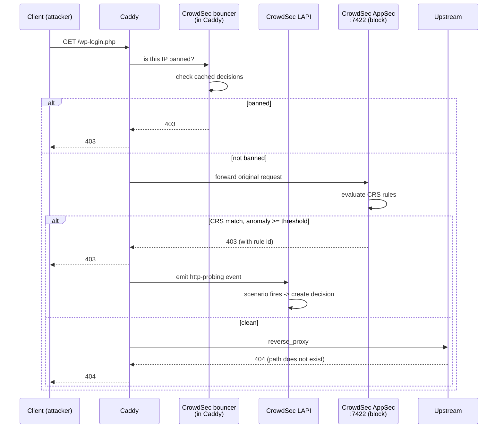
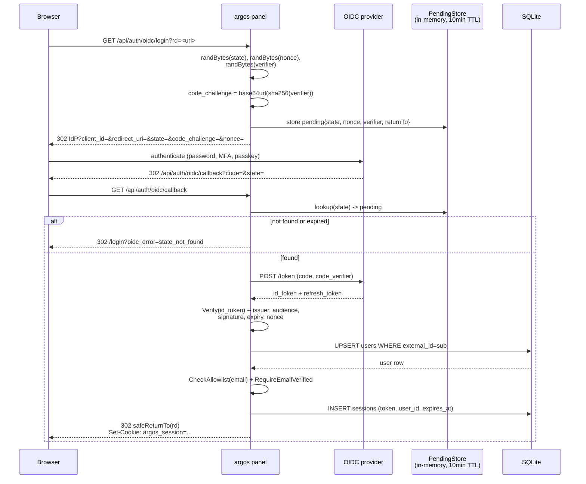
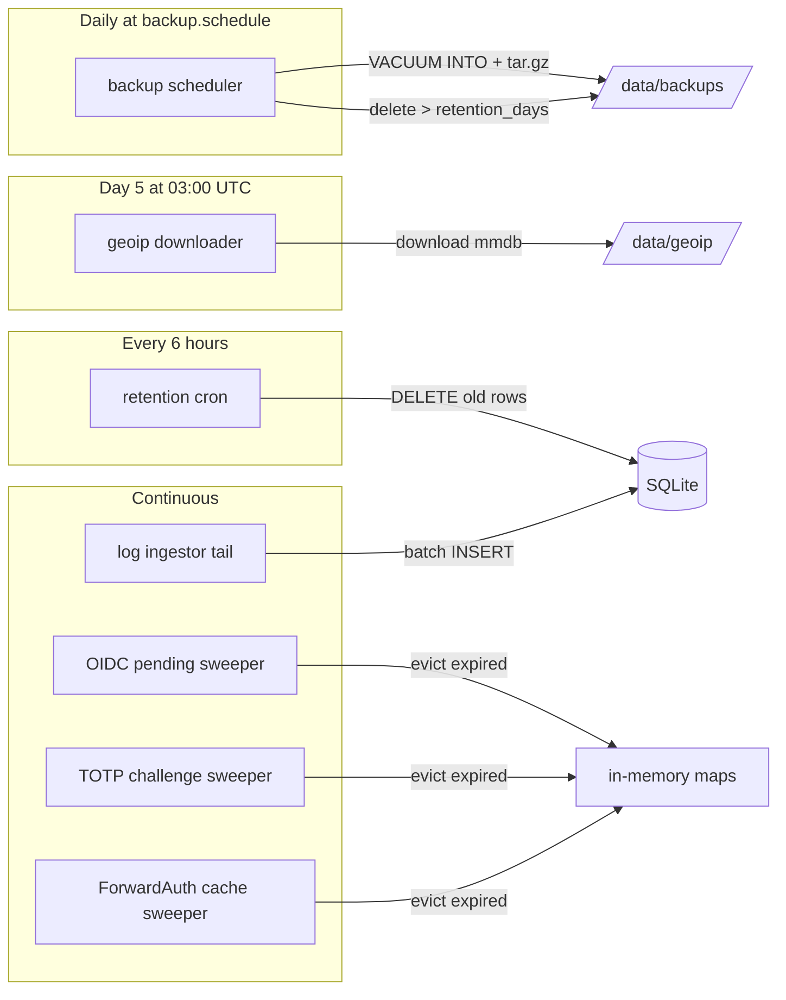

# Request flow

Four walk-throughs of the common paths: attacker blocked at the
edge, legitimate user on a ForwardAuth-protected host, OIDC login,
and background cron work.

## Attacker hitting a WAF-protected host

A scanner probing `/wp-login.php` on a host argos fronts.



Key properties:

- **Bouncer check is cache-resident.** No LAPI round-trip on the
  happy path; decisions are refreshed on a 15 s poll.
- **WAF runs in-band.** Caddy waits for AppSec to return a verdict
  before continuing. Latency budget is single-digit ms on matched
  rules, sub-ms on unmatched.
- **CrowdSec scenarios aggregate.** A single 404 does not ban;
  N of them in a time window does.

## Legitimate user on a ForwardAuth-protected host

```mermaid
sequenceDiagram
    participant C as Browser
    participant Cad as Caddy
    participant Argos as argos /auth/forward
    participant DB as SQLite
    participant U as Upstream

    C->>Cad: GET https://myapp.example.com/dashboard<br/>(cookie: argos_session=...)
    Cad->>Argos: forward_auth sub-request<br/>(X-Forwarded-*, Cookie)
    alt cache hit (30s TTL)
        Argos->>Argos: lookup(token) -> rec
    else cache miss
        Argos->>DB: SELECT session JOIN user WHERE token=?
        DB-->>Argos: row
        Argos->>DB: UPDATE sessions SET last_seen_at=NOW<br/>(throttled; skip if <5 min old)
        Argos->>Argos: cache put(token, rec, exp=now+30s)
    end
    Argos-->>Cad: 200 OK<br/>X-Auth-User, X-Auth-Email, X-Auth-Name, X-Auth-Provider
    Cad->>U: GET /dashboard<br/>(X-Auth-* copied on upstream request)
    U-->>Cad: 200
    Cad-->>C: 200
```

On a cookie miss the handler reconstructs the original URL from
Caddy's `X-Forwarded-{Proto,Host,Uri}` headers and returns a 302
to `panel.example.com/login?rd=<escaped-url>`. The panel's OIDC
(or password) flow mints a session cookie with `Domain=example.com`
so the next request on `myapp.example.com` carries it.

## OIDC login



Key integrity properties enforced in sequence:

1. `state` is single-use and expires in 10 min.
2. `code_verifier` is never transmitted on the initial redirect
   (only the challenge is), so a leaked auth URL cannot recover
   the token.
3. `nonce` is compared against the id_token's nonce claim after
   signature verification.
4. Email allowlist + `email_verified` gate fire AFTER the id_token
   is trusted.
5. `safeReturnTo` rejects backslash, control chars, and
   off-domain URLs before issuing the final redirect.

## Background cron work

Argos runs several time-driven goroutines against the main context.



What each does:

- **retention cron** — every 6 h and once at boot: drops
  `log_entries` older than `logs.retention_days` OR beyond
  `logs.max_entries` cap, drops `login_attempts` + `totp_attempts`
  older than 24 h. Also runs `maybeVacuum()` which VACUUMs once
  a month on day 1 at 04:00 UTC.
- **backup scheduler** — matches the `backup.schedule` cron (default
  `0 2 * * *` = 02:00 UTC daily). Runs `VACUUM INTO` snapshot,
  tars with metadata.json + caddy_data, SHA-256s, records a
  `backups` row, then applies `backup.retention_days`.
- **geoip downloader** — hardcoded `0 3 5 * *` (day 5, 03:00 UTC).
  Pulls `db-ip-city-lite.mmdb.gz` and `db-ip-asn-lite.mmdb.gz`
  from the DB-IP mirror, gunzips, atomic rename into place. Plus
  a non-blocking run at first boot if either file is missing.
- **log ingestor** — constantly tails Caddy's access + error +
  WAF audit files, parses the structured JSON, batches 100-row
  INSERTs into `log_entries`. Also picks up audit entries
  enqueued by `Recorder.Record`.
- **sweepers** — garbage-collect per-subsystem in-memory maps.
  Low-frequency ticks (TTL/2 each).

All cron work logs to structured slog with the `source=audit`
shape when it mutates state; you can trail them in the Logs tab
with `source = audit`.

## Related

- [Components](components.md) — the container map.
- [Storage](storage.md) — SQLite tuning, migration runner.
- [Threat model](threat-model.md) — what each handler is
  defending against.
