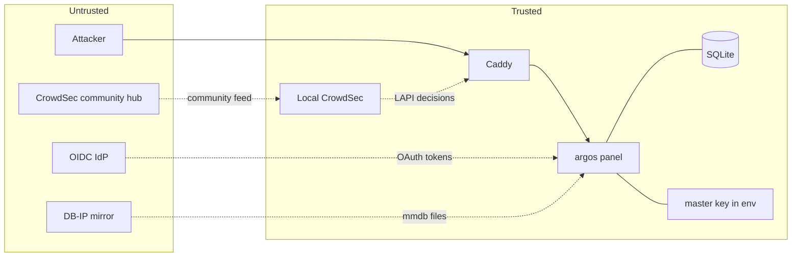

# Threat model

What argos defends against, what it does not, and where the
trust boundaries live.

## Scope and non-scope

Argos is a single-operator homelab panel. The threat model
covers:

- External attackers reaching published hosts from the internet.
- Credential-stuffing / brute-force attempts against the panel
  login itself.
- Compromise of a single dependency (an OIDC IdP, an upstream
  service, the SMTP relay used for notifications).

Outside the model:

- A compromised host OS or docker daemon. If the attacker is root
  on the VM, game over — the master key is in `.env`, the DB is
  one file, all secrets decrypt.
- A physical attacker with console access.
- Multi-operator threat models (insider risk across admins).
  There is only one admin tier; the model assumes everyone with
  a panel login is trusted equally.
- DoS at the network layer. Argos does per-IP rate limiting at
  the application layer; volumetric floods are the host provider
  / router's problem.

## Trust boundaries

- **Boundary 1** — internet <> Caddy. TLS at the edge, ACME for
  certs. CrowdSec bouncer drops known-bad IPs before any other
  handler.
- **Boundary 2** — Caddy <> argos. Docker bridge only; argos
  never exposed to the public internet in `behind_caddy` mode.
  In `lan` mode, argos IS reachable on the LAN -- treat the LAN
  as trusted.
- **Boundary 3** — argos <> OIDC IdP. Tokens validated against
  issuer's JWKS; `state` + `nonce` + PKCE prevent
  code-injection attacks.
- **Boundary 4** — argos <> master key. Env-only. Never on disk
  inside the image.

## Attack surfaces and mitigations

### Public ingress (Caddy)

| Attack | Mitigation |
|---|---|
| Credential stuffing against WAF-unaware backends | WAF opt-in per host (detect -> block), with per-host rate limit under `host_security` |
| Application-layer attacks (SQLi, XSS, LFI, RCE) | Coraza + OWASP CRS, paranoia 1-4, per-rule exclusions for FPs |
| Known-bad IPs | CrowdSec bouncer, 15 s poll. Bans from both local scenarios and the community feed |
| Distributed scanners | CrowdSec `http-probing` + `http-crawl-non_statics` scenarios produce fresh decisions at detection time |
| DDoS / volumetric | Host rate limit (`ip` key) + upstream protection. Argos does NOT do bandwidth shaping; use the host's firewall. |
| Cert stripping | HSTS (in `behind_caddy` mode) — max-age one year, includeSubDomains |
| Clickjacking | `X-Frame-Options: DENY` + CSP `frame-ancestors 'none'` |

### Panel login

| Attack | Mitigation |
|---|---|
| Brute-force password | bcrypt cost 12 (~300 ms per attempt). 5 fails in 5 min per IP -> 30 min ban, persisted so restart does not reset the ban. |
| Username enumeration via timing | `Authenticate` runs the same bcrypt cycle on unknown-user, OIDC-only, and wrong-password paths. Verified by `TestAuthenticateTimingParity`. |
| IP spoofing to bypass rate limit | chi `middleware.RealIP` only installed in `behind_caddy` mode; in `lan` mode the handler uses the socket address directly. |
| Replay of TOTP code | TOTP codes are time-window-bound; argos verifies with ±1 period skew. Recovery codes single-use via CAS on the encrypted blob. |
| Session hijack on logout | Logout deletes the DB row AND invalidates the ForwardAuth cache entry eagerly, so protected hosts bounce on the very next request. |

### OIDC callback

| Attack | Mitigation |
|---|---|
| CSRF on the OAuth callback | `state` is server-generated, single-use, 10 min TTL. |
| Authorization code injection | PKCE S256. The `code_verifier` never leaves argos; the IdP only sees the `code_challenge`. |
| Token replay | `nonce` is checked against the id_token's nonce claim after signature verification. |
| Malicious IdP asserting someone else's email | `oidc.require_email_verified` (opt-in) rejects claims without `email_verified=true`. Also the email+domain allowlist. |
| Open redirect via `rd=` param | `safeReturnTo` validator: relative paths allowed, absolute URLs only for panel host + cookie parent domain subtree, `\` and `%5c` rejected, control characters rejected. |

### Secrets at rest

| Attack | Mitigation |
|---|---|
| DB file exfiltration | AES-GCM at-rest encryption for OIDC `client_secret`, SMTP password, Telegram bot token, VAPID private key, TOTP secret, recovery codes. Master key lives in env only. |
| Nonce reuse | Fresh 12-byte random nonce per encrypt; never reused. |
| Master key exposure | Not mitigated beyond env var discipline; loss of the key is loss of all encrypted secrets. Document this to the operator. |

### ForwardAuth

| Attack | Mitigation |
|---|---|
| Direct hit on backend bypassing Caddy | OUT of scope -- operator must bind backends to docker bridge only. Documented explicitly in [ForwardAuth](../features/forward-auth.md). |
| Header injection of `X-Auth-*` | Same as above. Caddy sets the headers freshly on every forward_auth round-trip; upstream trust is operator's responsibility. |
| Stale session after logout | 30 s max window, minimised by eager cache eviction. |

### Panel data plane

| Attack | Mitigation |
|---|---|
| SQL injection | Every query in the codebase is parameterised; the only `fmt.Sprintf` into SQL is `VACUUM INTO '<os-generated-path>'` which cannot embed user input. |
| Path traversal in file ops | Backup file handling uses `filepath.Join` + explicit prefix check; restore extracts only within `/data`. |
| Audit log bypass | Every mutation runs through `h.audit` or `h.Audit.Record`. Verified by the `fix(security)` commit that backfilled missing audit fields. |
| DoS via memory-growing feature | PendingStore + TOTPStore sweepers cap memory; rate limit bucket map bounded by channel count; log ingestor uses a non-blocking channel that drops on saturation rather than grow. |

## Residual risks

Things the panel does NOT protect against and it is up to the
operator to mitigate:

1. **Loss of `ARGOS_MASTER_KEY`.** Every encrypted secret
   becomes unrecoverable. Keep the key in a password manager
   independent of the panel.
2. **Compromise of the host.** Root on the VM means the attacker
   reads the env file, the DB, and the master key. Use a minimal
   LXC / VM with only argos on it; do not run argos on the same
   host as untrusted workloads.
3. **Backup integrity.** Argos records SHA-256 but does not sign.
   An attacker with write access to `/data/backups/` can swap in
   a malicious archive that the restore path will extract.
   Protect the backup directory at the filesystem level.
4. **External IdP compromise.** If Google / Microsoft / Authentik
   is compromised, argos accepts tokens the attacker mints. Break
   glass: `oidc.enabled=false` disables the SSO path; local admin
   + TOTP still work.
5. **Caddy admin API.** Reachable only over the docker bridge but
   still unauthenticated. A container escape could reconfigure the
   edge. Mitigate via container hardening (no `--privileged`,
   read-only mounts where possible).

## Security features we lean on but do not own

- **TLS** — Caddy's ACME client for Let's Encrypt, vendored.
- **WAF** — Coraza + OWASP CRS, vendored in the Caddy build.
- **Threat intel** — CrowdSec community blocklist feed.
- **bcrypt** — `golang.org/x/crypto/bcrypt`.
- **AES-GCM** — Go stdlib `crypto/cipher`.
- **PKCE verifier + id_token verification** —
  `github.com/coreos/go-oidc/v3/oidc` + `golang.org/x/oauth2`.
- **Geo data** — DB-IP Lite (CC-BY license).

## Related

- [OIDC SSO](../features/auth-oidc.md) — IdP trust surface.
- [ForwardAuth](../features/forward-auth.md) — backend trust
  caveats.
- [Operations / Tuning](../operations/tuning.md) — tightening
  the posture.
