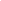

# Backups

Argos takes local tar.gz snapshots of its own DB + the Caddy state
on a schedule you set. Everything lives under `/data/backups/`
inside the argos container, backed by the `argos_data` named
volume.

Off-site replication is NOT argos' responsibility — mirror the
`/data/backups/` directory with rclone / borg / rsync as a
sidecar if you need it.

## What is in each archive

A tar.gz under `/data/backups/argos-backup-<ts>.tar.gz` containing:

- **`argos.db`** — a `VACUUM INTO` snapshot of the live DB. Fully
  consistent, no WAL residue. Same schema as the running DB.
- **`metadata.json`** — argos version, git commit, schema version,
  `kind` (`manual` / `scheduled` / `orphan`), timestamp UTC, count
  of caddy files actually included (see below).
- **`caddy/`** (optional) — copy of the Caddy data directory as
  seen by the argos container (read-only mount). Holds TLS certs +
  ACME state.

The caddy subtree is **best-effort**. `caddy_data` is mounted
read-only into argos; some files under it may be owned by root
(caddy container runs as root by default) and unreadable by the
`nobody` user argos runs as. Those files are skipped silently;
metadata.json records the actual count written.

If the caddy count is zero on every backup, set up the volume
permissions so argos can read `/caddy_data` and redo the next
scheduled run.

## Scheduler

One cron expression owns the schedule. Settings:

- `backup.enabled` — `true` / `false`. Default true.
- `backup.schedule` — cron expression (minute, hour, day, month,
  dow). Default `0 2 * * *` (02:00 UTC daily).
- `backup.retention_days` — int, default 14. After each run,
  archives older than N days are deleted (both the tar.gz on disk
  and the row in `backups`).
- `backup.path` — display-only; the actual path is
  `/data/backups/` inside the container, baked into the image.

Change via **System → Settings → Backups**. The scheduler picks
up the new cron on next restart; edits do NOT hot-reload today.
There is no risk of a missed run because the tick only fires on
wall-clock cron matches, not on a countdown.

{ loading=lazy alt="System Settings Backup section with enabled toggle, cron expression field, and retention days" }

## Manual backup

**Backups → New backup**. Adds a row with `kind='manual'`, runs
the same pipeline as the scheduled job, surfaces the tar.gz in
the list. Useful before an upgrade.

Manual backups honour the SAME retention window as scheduled ones
— if you take a manual backup as an anchor before a risky change,
consider `backup.retention_days` to make sure it survives.

## Verify integrity

Every row has a `sha256` column. From inside the container:

```bash
docker compose exec argos sh -c '
  cd /data/backups && sha256sum -c <(sqlite3 /data/argos.db \
    "SELECT sha256 || \"  \" || filename FROM backups")
'
```

Mismatches indicate disk corruption on the backup volume.

## Restore

Three paths, documented in [Restore from backup](../workflows/
restore-backup.md):

- In-place from the Backups tab (restart required).
- CLI from the container when the panel is unreachable:
  `argos restore --file <path> --yes`.
- HTTP upload + restore endpoint (authed) when you need to load an
  archive that is not in the current Backups tab.

All three write `/data/.restore_pending` as a restart marker and
let the next boot extract.

## Orphan reconcile

The backup manager also reconciles the filesystem vs the DB on
boot:

- A tar.gz present on disk but not in the `backups` table gets a
  row with `kind='orphan'`. You can still restore from it.
- A row in the `backups` table whose file is missing is deleted
  from the table on the next reconcile.

This means copying a backup onto the volume from another host
works: restart the container, the orphan appears in the list.

## What is NOT backed up

- **CrowdSec's DB** (`crowdsec_data` volume). Separate concern;
  the feed re-downloads on its own, and bouncer bans from local
  detection reset.
- **In-memory state**: pending OIDC logins, TOTP challenges,
  ForwardAuth cache, notification rate-limit buckets. All
  intentionally ephemeral.
- **Caddy's access + error logs**. These live as files that
  argos' log ingestor tails into `log_entries`; the rows up to
  the backup point are included, anything after is gone with
  the log files.

## Disk sizing

A homelab panel with 10-20 hosts produces tar.gz in the
~10-50 MB range each. With `retention_days=14` you expect
~200-700 MB of backups volume. Scale linearly with host count.

## Gotchas

- **Clock-skew collisions**: archive filenames encode the UTC
  timestamp to the second. If the host clock jumps backwards
  during a run and a same-second backup already exists, argos
  appends `-1`, `-2` etc. Beyond 100 collisions it aborts —
  clock sync is broken.
- **Disk full**: the manager does NOT pre-check free space.
  A run that fills the volume leaves a partial `.partial` file
  which is cleaned up on the next boot's orphan reconcile.
- **Backups do not contain `.env`**. Secrets (session secret,
  master key, initial admin password) live outside the panel.
  Keep them in your password manager or secrets store —
  restoring the panel without the original `ARGOS_MASTER_KEY`
  leaves every encrypted setting (OIDC client secret, SMTP
  password, Telegram token, VAPID private key) unrecoverable.

## Related

- [Restore from backup](../workflows/restore-backup.md) —
  operational walkthrough.
- [Upgrading](../operations/upgrading.md) — always back up first.
- [CLI](../reference/cli.md) — `argos restore`.
