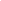

# CrowdSec

CrowdSec gives argos two things: a **local detection engine** that
reads Caddy's access logs and produces decisions for IPs behaving
badly, and a **community blocklist** pulled from the CrowdSec hub
every few minutes. Both result in bans that Caddy's bouncer plugin
enforces at the edge, before any other argos logic runs.

## What lives where

- **CrowdSec LAPI** daemon in the `crowdsec` container. Owns
  scenarios, parsers, decisions. SQLite-backed at
  `/var/lib/crowdsec/data/crowdsec.db`.
- **AppSec component** in the same container (see [WAF](waf.md)).
- **Caddy bouncer plugin** inside the `caddy` container. Polls
  LAPI every `crowdsec.poll_interval_seconds` (default 15 s),
  caches active decisions, blocks matching IPs in-band.
- **Argos panel** reads LAPI via the `machine` credentials for
  the **Threats** tab + decisions write endpoint.

Two separate credentials are used:

- **Bouncer API key** — Caddy's read-only hook to fetch decisions.
- **Machine user + password** — argos' admin hook used to list /
  create / delete decisions through the LAPI.

Both live as settings (`crowdsec.bouncer_api_key`,
`crowdsec.machine_user`, `crowdsec.machine_password`). Empty
values disable the panel's CrowdSec features; the bouncer reads
its key straight from env (`CROWDSEC_BOUNCER_API_KEY` in `.env`)
and does not depend on the panel.

## First-run setup

One-time cscli dance against the running CrowdSec container:

```bash
# 1. Add a bouncer for Caddy.
docker compose exec crowdsec cscli bouncers add caddy-edge
# copy the printed key into .env as CROWDSEC_BOUNCER_API_KEY
docker compose restart caddy

# 2. Create a machine user for the panel.
docker compose exec crowdsec cscli machines add argos-panel --password
# enter a password; copy both into Settings -> CrowdSec
# (Machine user + password).

# 3. Enroll the instance to get the community blocklist.
docker compose exec crowdsec cscli console enroll <your-enrollment-code>
```

Enrollment is optional but recommended — without it, the
community feed is unavailable and you only get local detection.

## Scenarios (detection)

CrowdSec ships with dozens of scenarios under
`crowdsecurity/`. Relevant ones for an argos deploy:

- `crowdsecurity/http-crawl-non_statics` — crawler hitting
  non-static paths at rate.
- `crowdsecurity/http-probing` — 404-storm scanner.
- `crowdsecurity/http-bad-user-agent` — malformed / known-bad UAs.
- `crowdsecurity/http-bf-wordpress_bf` — WordPress brute-force.
- `crowdsecurity/http-xss-probing` — stored XSS scanner.

Extend from the hub: `cscli collections install`. argos surfaces
the currently-installed collection list in **Threats → Scenarios**.

## Decisions

A decision is: `(ip | cidr | range, scenario, duration, origin)`.
Origins:

- `crowdsec` — local detection produced it.
- `community-blocklist` — pulled from the community feed.
- `cscli` — created manually via the CLI.
- `argos-panel` — created via **Threats → Add decision**.

The bouncer caches active decisions and returns 403 for matching
IPs **before** they reach Caddy's reverse_proxy. That is a key
property — an IP banned by CrowdSec never has the chance to hit
your WAF, rate limit, or upstream.

### Creating a decision from argos

**Threats → Add decision**:

- IP (or CIDR, e.g. `192.0.2.0/24`).
- Duration — `4h`, `24h`, `7d`, or a Go-duration string.
- Reason — free text. Ends in the audit log + the LAPI row.

The decision takes effect on the next bouncer poll.

### Removing a decision

**Threats → *row* → Delete decision**. Same latency as above.

The argos audit log keeps the trail whether the decision is still
active or not.

{ loading=lazy alt="Threats tab with a list of active CrowdSec decisions including IP, scenario, duration, origin, and delete buttons" }

## Connectivity surface

- `crowdsec.enabled` (setting) — master toggle for the panel's
  CrowdSec features. Off = Threats tab 503s, bouncer still runs.
- `crowdsec.lapi_url` — LAPI endpoint, default
  `http://crowdsec:8081` (docker bridge name). Change only if you
  run CrowdSec outside the compose stack.
- `crowdsec.poll_interval_seconds` — how often the bouncer refreshes
  its cached decision set. 15 s default. Lower = tighter reaction
  but more LAPI load; higher = coarser.

## Panel status

**Threats → Status** (sub-tab) aggregates:

- Bouncer configured: yes/no (did Caddy receive a valid key?).
- LAPI reachable: yes/no.
- Community enrolled: yes/no + last sync.
- Currently active decisions count + origin breakdown.
- Installed collections count.

When the feed sync fails for long enough the panel emits a
`crowdsec_down` notification event (see
[Notifications](notifications.md)).

## Gotchas

- **The bouncer runs in Caddy, not argos.** A panel outage does
  not stop ban enforcement. Restarting the argos container does not
  clear bans.
- **CrowdSec's own DB is not in argos backups.** If you lose the
  `crowdsec_data` volume you re-enroll; community feed re-downloads
  on its own.
- **Local decisions are time-bounded.** Default scenario durations
  are in the minutes-to-hours range. Long-term bans need the
  community feed or a manually added decision.
- **Enrolling re-keys the instance.** If you enroll a machine that
  was already enrolled under a different code, the old enrollment
  rotates out. Keep the codes somewhere recoverable.

## Related

- [WAF](waf.md) — sibling component; WAF fires AFTER the bouncer
  check.
- [Respond to an attack](../workflows/respond-to-attack.md) —
  operational flow.
- [Notifications](notifications.md) — alert on bans + CrowdSec
  outages.
