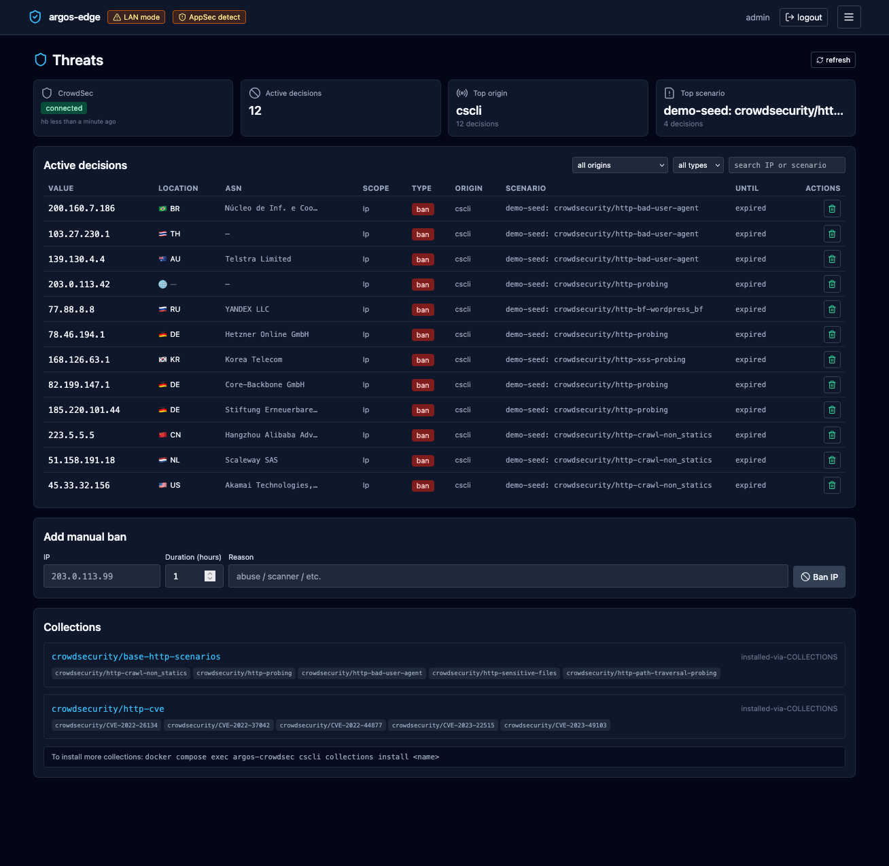

# CrowdSec

CrowdSec gives argos two things: a **local detection engine** that
reads Caddy's access logs and produces decisions for IPs behaving
badly, and a **community blocklist** pulled from the CrowdSec hub
every few minutes. Both result in bans that Caddy's bouncer plugin
enforces at the edge, before any other argos logic runs.

## What lives where

- **CrowdSec LAPI** daemon in the `crowdsec` container. Owns
  scenarios, parsers, decisions. SQLite-backed at
  `/var/lib/crowdsec/data/crowdsec.db`.
- **AppSec component** in the same container — a separate HTTP
  listener (`:7422` / `:7423`) that inspects each request's payload
  against Coraza + OWASP CRS rules. **Independent from the LAPI
  bouncer**; can be on, off, or broken without affecting IP bans.
  See [AppSec (CrowdSec WAF-inline)](appsec.md) for the setup
  story, the three operating scenarios, and the `appsec.fail_open`
  policy. [WAF](waf.md) covers the rule-level UI on top of it.
- **Caddy bouncer plugin** inside the `caddy` container. Polls
  LAPI every `crowdsec.poll_interval_seconds` (default 15 s),
  caches active decisions, blocks matching IPs in-band.
- **Argos panel** reads LAPI via the `machine` credentials for
  the `/security` tabs + the country expansion / decision-list /
  drift-detection endpoints. The panel also runs three reconciler
  goroutines (drift detector, country reconciler, country
  JobRunner) — see [Components](../architecture/components.md#argos-panel)
  for the full list.

Two separate credentials are used:

- **Bouncer API key** — Caddy's read-only hook to fetch decisions.
- **Machine user + password** — argos' admin hook used to list /
  create / delete decisions through the LAPI.

Both live as settings (`crowdsec.bouncer_api_key`,
`crowdsec.machine_user`, `crowdsec.machine_password`). Empty
values disable the panel's CrowdSec features; the bouncer reads
its key straight from env (`CROWDSEC_BOUNCER_API_KEY` in `.env`)
and does not depend on the panel.

## First-run setup

One-time cscli dance against the running CrowdSec container:

```bash
# 1. Add a bouncer for Caddy.
docker compose exec crowdsec cscli bouncers add caddy-edge
# copy the printed key into .env as CROWDSEC_BOUNCER_API_KEY
docker compose restart caddy

# 2. Create a machine user for the panel.
docker compose exec crowdsec cscli machines add argos-panel --password
# enter a password; copy both into Settings -> CrowdSec
# (Machine user + password).

# 3. Enroll the instance to get the community blocklist.
docker compose exec crowdsec cscli console enroll <your-enrollment-code>
```

Enrollment is optional but recommended — without it, the
community feed is unavailable and you only get local detection.

## Scenarios (detection)

CrowdSec ships with dozens of scenarios under
`crowdsecurity/`. Relevant ones for an argos deploy:

- `crowdsecurity/http-crawl-non_statics` — crawler hitting
  non-static paths at rate.
- `crowdsecurity/http-probing` — 404-storm scanner.
- `crowdsecurity/http-bad-user-agent` — malformed / known-bad UAs.
- `crowdsecurity/http-bf-wordpress_bf` — WordPress brute-force.
- `crowdsecurity/http-xss-probing` — stored XSS scanner.

Extend from the hub: `cscli collections install`. argos surfaces
the currently-installed collection list under
**Security → Scenarios**, which also lets you toggle individual
scenarios off (the operator-disabled set is materialised into
a sentinel + consumed on the next `setup-appsec.sh` run; see
[Scenarios management](#scenarios-management) below).

The Scenarios tab also enriches each row with the hub-catalogue
description on hover (v1.3.30). The descriptions come from a
slimmed `/data/shared/argos-scenarios-index.json` that
setup-appsec.sh produces from the read-only-mounted hub
catalogue (the **reverse-sentinel pattern** —
`docs/architecture/storage.md#out-of-band-sentinels-datashared`).

## Scenarios management

`Security → Scenarios` lets you disable installed scenarios
without uninstalling the underlying collection. The flow:

1. Operator clicks "Disable" on a scenario in the panel.
2. Panel writes the canonical name to
   `/data/shared/argos-disabled-scenarios.txt`.
3. Operator runs `docker compose exec crowdsec /setup-appsec.sh`.
4. Script `cscli scenarios remove --force`s each line.
5. CrowdSec reloads.

Re-enable: same flow in reverse (panel removes from sentinel;
script re-installs the collection on next run).

The drift detector (60s ticker) catches the gap between step 2
and step 4: while the panel claims a scenario is disabled but
the script hasn't run yet, the `/security/scenarios` tab shows
a "Pending reload" badge. See
[Drift detection](drift-detection.md) for the full protocol.

## LAPI tuning (v1.3.28+)

CrowdSec ships with a `flush.max_items: 5000` default cap on the
alerts table. Two argos-specific config knobs in
`crowdsec/config.yaml.local` matter for stability:

- **`db_config.use_wal: true`** (v1.3.28). Without WAL, the
  community-blocklist sync (~15k decisions every ~2h) holds an
  exclusive writer lock that stalls the panel's `/v1/decisions`
  reads for 3-4 seconds. CrowdSec emits a startup warning when
  this is off:

  > sqlite is not using WAL mode, LAPI might become unresponsive
  > when inserting the community blocklist

  argos's shipped `config.yaml.local` sets `use_wal: true`.

- **`flush.max_items` interaction with bulk emit**. v1.3.31's
  per-CIDR alert shape collided with this cap and silently
  flushed older argos-country-* alerts when the operator
  expanded multiple countries totalling >5000 CIDRs. v1.3.33's
  alert-shape restructure (one alert with N decisions inside,
  mirroring CAPI's community-blocklist pattern) eliminates the
  collision; bulk emit is now ~ceil(N/500) alerts per call
  instead of N.

Bumping `flush.max_items` is NOT necessary post-v1.3.33; the
default 5000 is sufficient with the new shape.

## Decisions

A decision is: `(ip | cidr | range, scenario, duration, origin)`.
Origins:

- `crowdsec` — local detection produced it.
- `community-blocklist` — pulled from the community feed.
- `cscli` — created manually via the CLI.
- `argos-panel` — created via **Threats → Add decision**.

The bouncer caches active decisions and returns 403 for matching
IPs **before** they reach Caddy's reverse_proxy. That is a key
property — an IP banned by CrowdSec never has the chance to hit
your WAF, rate limit, or upstream.

### Creating a decision from argos

**Threats → Add decision**:

- IP (or CIDR, e.g. `192.0.2.0/24`).
- Duration — `4h`, `24h`, `7d`, or a Go-duration string.
- Reason — free text. Ends in the audit log + the LAPI row.

The decision takes effect on the next bouncer poll.

### Removing a decision

**Threats → *row* → Delete decision**. Same latency as above.

The argos audit log keeps the trail whether the decision is still
active or not.

{ loading=lazy alt="Threats tab with a list of active CrowdSec decisions including IP, scenario, duration, origin, and delete buttons" }

## Connectivity surface

- `crowdsec.enabled` (setting) — master toggle for the panel's
  CrowdSec features. Off = Threats tab 503s, bouncer still runs.
- `crowdsec.lapi_url` — LAPI endpoint, default
  `http://crowdsec:8081` (docker bridge name). Change only if you
  run CrowdSec outside the compose stack.
- `crowdsec.poll_interval_seconds` — the bouncer's `ticker_interval`
  (15 s). It only matters in stream mode; the panel configures the
  bouncer in **live mode** (v1.3.20+), where Caddy asks the LAPI on
  every request and keeps no decision cache. See "What happens if
  CrowdSec is down".

## Panel status

**Threats → Status** (sub-tab) aggregates:

- Bouncer configured: yes/no (did Caddy receive a valid key?).
- LAPI reachable: yes/no.
- Community enrolled: yes/no + last sync.
- Currently active decisions count + origin breakdown.
- Installed collections count.

When the feed sync fails for long enough the panel emits a
`crowdsec_down` notification event (see
[Notifications](notifications.md)).

## What happens if CrowdSec is down

Written down because the answer is not the intuitive one. The
Caddy bouncer (`caddy-crowdsec-bouncer` v0.12.1) is configured by
the panel with `enable_streaming: false`, `enable_hard_fails`
unset (false) and `appsec_fail_open: true` (read the live config
at `/config/apps/crowdsec` on the Caddy admin API).

- **Live mode, no cache.** Every request asks the LAPI
  (`GET /v1/decisions?ip=`) and nothing is kept in Caddy. When the
  LAPI does not answer, the lookup fails, the bouncer logs the
  error and, because `hard_fails` is off, lets the request through
  (`return nil, nil` in the bouncer's decision path). **While the
  crowdsec container is down or restarting, no CrowdSec ban is
  enforced**: not the community blocklist, not country bans, not
  manual ones.
- **AppSec does not inspect.** The AppSec handler calls
  `appsec_url` per request; on a connection error, timeout (2 s) or
  unexpected status it returns nil when `appsec_fail_open` is true,
  so the request continues uninspected. The panel's periodic probe
  raises the `appsec_unavailable` notification, whose text says
  both things.
- **What the panel shows.** Threats and Banned IPs answer 502
  (`lapi: ...`) until the LAPI is back; the Dashboard security
  section and the Security overview serve their last AppSec figures
  for one cache period and then report `appsec_error`; the
  crowdsec heartbeat monitor raises `crowdsec_down`.
- **The alternative.** `enable_hard_fails: true` makes the bouncer
  call `logger.Fatal` on a failed lookup: Caddy exits and every
  host is down, protected or not. `appsec_fail_open: false` returns
  500 for every request while AppSec is unreachable. The panel
  chose fail-open (v1.3.2 for AppSec, v1.3.20 for the bouncer): on a
  homelab a dead sidecar must degrade to "unprotected", not to
  "offline". The trade-off is that a CrowdSec restart is an
  unprotected window of 10-15 s (container start to LAPI ready),
  and a CrowdSec crash is an unprotected outage until it is back.
- **Stream mode** (decisions downloaded every `ticker_interval` and
  cached in Caddy, so bans already downloaded keep applying while
  the LAPI is down, and no per-request LAPI call) is on the table
  for the v1.3.40 PHASE 0: v1.3.20 chose live mode for a reason
  recorded in that release's notes, to be re-read before proposing
  a change.

## Gotchas

- **The bouncer runs in Caddy, not argos.** A panel outage does
  not stop ban enforcement. Restarting the argos container does not
  clear bans. A CrowdSec outage does stop enforcement (previous
  section).
- **CrowdSec's own DB is not in argos backups.** If you lose the
  `crowdsec_data` volume you re-enroll; community feed re-downloads
  on its own.
- **Local decisions are time-bounded.** Default scenario durations
  are in the minutes-to-hours range. Long-term bans need the
  community feed or a manually added decision.
- **Enrolling re-keys the instance.** If you enroll a machine that
  was already enrolled under a different code, the old enrollment
  rotates out. Keep the codes somewhere recoverable.

## Related

- [WAF](waf.md) — sibling component; WAF fires AFTER the bouncer
  check.
- [Respond to an attack](../workflows/respond-to-attack.md) —
  operational flow.
- [Notifications](notifications.md) — alert on bans + CrowdSec
  outages.
