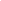

# Logs browser

`/logs` is the single pane for every structured event the panel
collects: Caddy access + error logs, WAF audit rows, and the panel's
own audit trail. One filter UI, one table, one entry drawer.

For what gets ingested and the retention knobs, see
[Observability](observability.md) and [Settings](settings.md).

## Time range

Quick-range buttons at the top: **15m**, **1h**, **6h**, **24h**,
**7d**. Default is 1h. The range is disabled while Live tail is on
(see below) — in that mode you are looking at a sliding window of
incoming events, not a query.

## Filters

Six fields in a row under the range selector:

| Filter | Accepts |
|---|---|
| **search (q)** | Free-text match against message + raw body. |
| **source** | `All sources`, `caddy_access`, `caddy_error`, `audit`. `waf_audit` is not in the dropdown but is valid — the preset selector and per-host "Logs" action pass it directly. |
| **status** | HTTP status codes or classes: `200`, `4xx`, `200-299`, `4xx,5xx`. |
| **method** | `GET`, `POST`, or a comma list: `GET,POST`. |
| **path** | Literal substring match. Toggle the **re** checkbox to the right to treat the input as a regex (`re:` prefix is added for you). |

A **Clear filters** button appears next to pagination when any field
is set.

Filter state is URL-driven: the "Logs" button on the [Security
overview](security-overview.md) and the "Trace similar" action in
the entry drawer both land you here with filters pre-applied via
`?source=...&host_id=...`.

## Presets

The dropdown labelled "Preset..." loads curated filter sets from the
backend:

| Preset | Filters |
|---|---|
| All errors | `status=4xx,5xx` |
| 5xx (last hour) | `status=5xx`, last 60 min |
| Slow requests | `source=caddy_access`, hint to filter by duration>1000 client-side |
| Certificate events | `source=caddy_error`, `q=acme` |
| Auth events | `source=audit`, `q=login` |
| Config changes | `source=audit`, `q=create update delete` |
| Blocked requests | `source=caddy_access`, `status=403` |
| WAF blocks | `source=waf_audit`, `waf_severity=CRITICAL,ERROR` |
| WAF alerts (24h) | `source=waf_audit`, last 24 h |

Applying a preset replaces the current filter set and fires a toast
so you notice it landed.

## Stats strip

Above the table, five cards summarise the current filtered query:

- **Total** — rows matching.
- **2xx** (emerald), **4xx** (amber), **5xx** (red) — counts by
  status class.
- **avg ms / p95** — aggregate durations across `caddy_access`
  entries in the result set.

The strip updates with every filter change.

## Table

Eight columns, fixed-width on the left so the Path/Message column
gets the most horizontal room:

| Column | Notes |
|---|---|
| Time | Relative ("2 minutes ago") for entries within the last 24 h, absolute (YYYY-MM-DD HH:MM:SS) otherwise. Tooltip always shows the absolute time. |
| Source | Small slate badge. |
| Host | Monospace domain, truncated. |
| Method | Monospace. |
| Path / Message | For `audit` rows, the audit message; everything else, the request path. Truncated at ~500 px. |
| Status | Colour-coded badge (emerald 2xx / amber 3xx / orange 4xx / red 5xx). |
| Dur | `<n>ms`, access rows only. |
| Remote IP | Monospace. |

Rows tint pink at 5xx, orange at 4xx, amber at 3xx so a wall of red
is visible at a scroll. Click any row to open the detail drawer.

## Entry drawer

The side drawer renders every non-empty field on the entry plus two
affordances:

- **GeoIP enrichment** — when `remote_ip` is public, the drawer
  fetches `/api/geoip/lookup` and shows the country flag + name +
  ASN/org on a sub-row under Remote IP. LAN IPs read as "LAN". See
  [Observability](observability.md) for the GeoIP subsystem.
- **Raw** — the full underlying row as stored, pre-formatted. Useful
  when diagnosing a parsing bug in the log producer.

Two actions at the bottom:

- **Copy raw** — copies the raw field (or the serialised entry if
  raw is empty) to the clipboard.
- **Trace similar** — reopens the list with filters set to match
  this entry's `source`, `status`, `method`, `path`, and `host_id`.
  Handy when one row of a burst tells you what pattern to hunt for.

## Live tail

The **Live off** button toggles to **Live** (red pill, radio icon)
and opens an EventSource against `/api/logs/stream`. New entries
stream in at the top of the table; history older than 500 rows is
dropped from memory to keep the page responsive.

While live:

- The range selector is hidden (live is its own time window).
- CSV export is disabled (the stream is unbounded).
- Current filters still apply server-side — you can live-tail only
  5xx, only WAF blocks, only a specific host.

Click **Live** again to stop. Dedup by entry ID is automatic so a
proxy that duplicates events does not double up the view.

## CSV export

The **CSV** button streams `/api/logs/export.csv?<current filters>`
through the browser's download path. Headers match the table columns
plus a few WAF-only fields. Use this when you need an incident
artifact — the panel does NOT keep logs beyond the retention window
configured in [Settings](settings.md), so export before a purge if
you want the trail.

## Pagination

Below the table: **Prev / Next** buttons plus a per-page selector
(50 / 100 / 200 / 500). The counter on the left reads
`<start>-<end> of <total>` so you always know where you are in the
result set.

{ loading=lazy alt="Logs tab with range selector on 1h, search and source/status/method/path filters, summary KPI cards for total and 2xx/4xx/5xx, and a rows table with timestamp, source badge, host, method, path, status and duration columns" }

## Related

- [Observability](observability.md) — the full observability surface
  (Dashboard / Security / Threats / Logs / GeoIP).
- [Security overview](security-overview.md) — per-host view that
  deep-links into this page with `source=waf_audit&host_id=<id>`.
- [Settings](settings.md) — retention, max entries, manual purge.
- [WAF](waf.md) — the `waf_audit` source origin.
