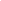

# Notifications

Event-driven alerting. Argos emits discrete events (cert expiring,
WAF burst, target unhealthy, backup finished, login failed, and
more), you attach channels + rules, the worker fans events out to
webhook / email / telegram / browser-push endpoints with per-
channel rate limits and per-rule throttle windows.

## Model

```
Event  ->  matching Rule(s)  ->  Channel  ->  Sender
```

- **Event** — what happened. `cert_renewal_failed`,
  `waf_attack_burst`, etc. Emitted by background watchers inside
  argos. Fire-and-forget.
- **Rule** — binds an event type to a channel, optionally filtering
  by host or severity, with a dedup window.
- **Channel** — one delivery endpoint of a given type. Several
  rules can share one channel.
- **Sender** — the type-specific worker (webhook/email/telegram/
  browser_push) that hits the third-party service.

## Event catalog

Every event carries `type`, `severity`, `message`, `data`, and an
optional `host_id`.

| Event                          | Triggered by |
|--------------------------------|--------------|
| `cert_expiring_soon`           | Daily check, cert within 14 days of expiry. |
| `cert_renewal_failed`          | Caddy's ACME renewal returned an error. |
| `waf_attack_burst`             | AppSec match rate over threshold in rolling window. |
| `waf_detect_mode_reminder`     | Host still in `detect` after N days; nudge to flip to `block`. |
| `target_unhealthy`             | Active health check flips a target to unhealthy. |
| `target_recovered`             | Target back to healthy after a prior failure. |
| `config_change`                | Any audited mutation to hosts / target groups / rules / security. |
| `rate_limit_triggered`         | Host rate-limit fired on a request. |
| `login_failed`                 | Failed password attempt (pre-ban). |
| `health_degraded`              | /system/health flags a subsystem (DB, worker queue, etc.). |
| `backup_completed`             | Scheduled or manual backup finished successfully. |
| `backup_failed`                | Backup error. Includes error string in data. |
| `config_restored`              | Restore endpoint extracted an archive. |
| `threat_ip_banned`             | A new CrowdSec decision was created via the panel. |
| `threat_intel_updated`         | Community blocklist pulled, N new / N expired. |
| `crowdsec_down`                | LAPI unreachable for long enough to page. |

Severities are `info`, `warning`, `error`, `critical`. The
frontend renders them with matching colors; senders can branch on
severity too.

## Channels

Four types, all implemented and active in the worker:

### webhook

Generic HTTP POST. Config fields:

- `url` (required)
- `method` — default `POST`.
- `headers` — map of string → string, applied literally.
- `body_template` — Go-text-template over the event; default is
  the full event marshalled as JSON.

Use for Slack (incoming webhook), Discord (webhook URL with a
`{"content": "..."}` body template), Gotify, custom webhook
endpoints.

### email

SMTP-based. Config fields:

- `host`, `port`, `username`, `password_encrypted`
- `tls_mode` — `starttls`, `tls`, or `none`.
- `from`, `to` (comma-separated list).
- `subject_template` / `body_template` — Go-text-template.

Password is encrypted at rest with `ARGOS_MASTER_KEY`. Use with a
dedicated SMTP relay (Mailgun, Postmark, Amazon SES) — avoid
shared personal mailboxes.

### telegram

Telegram Bot API. Config fields:

- `bot_token_encrypted`
- `chat_id`
- `message_template` (Markdown-V2 supported, default renders the
  event summary)

Message ≤4096 chars per Telegram's limit. The sender splits
longer messages automatically.

### browser_push

Web Push via VAPID. Keys auto-generate on first boot and live in
the notification settings table. Per-user subscriptions (`push_
subscriptions` table) are created when a signed-in user clicks
**Subscribe** in the panel's notification center.

Each sub stores endpoint + p256dh key + auth key; the sender uses
the panel-global VAPID private key to sign the message. Chrome /
Firefox / Edge (v20+) / Safari (macOS 13+) all supported.

## Rate limit per channel

Each channel has a token-bucket rate limiter:

- **rate_limit_per_minute** — capacity AND refill rate (tokens per
  minute). Default 10.
- `perMinute=0` disables limiting on the channel.

Exhausting the bucket does not drop events — the worker records a
`rate_limited` delivery in the `notification_deliveries` table
with error text, so you see that notifications *tried to fire* and
got held back. Bumps to the rate limit are live; the bucket
rebuilds itself on the next Allow() call.

The bucket is evicted on channel delete so a recreated channel
with the same id starts fresh.

## Throttle per rule

Separate from the channel rate limit, each rule has a
`throttle_window_seconds` that dedups the *same* event on the same
rule within the window:

- 0 (default) = no dedup, every event delivers.
- 300 = a second `target_unhealthy` for the same host within 5 min
  is suppressed.

Throttle state is in-memory; a panel restart clears it.

## Deliveries history

Every attempt (success, failure, rate-limited, throttled) lands in
`notification_deliveries`:

- `status` — `pending` / `sent` / `failed` / `throttled` /
  `rate_limited`.
- `event_payload` — the full marshalled event.
- `rendered_payload` — what the sender actually produced
  (post-template).
- `error_message` — if failed.
- `attempts` — retry counter; default max 3 with exponential
  backoff starting at 2 s.

View in **Notifications → Deliveries**. Individual deliveries
have a **Retry** button that replays through the sender.

{ loading=lazy alt="Notifications Deliveries tab with status filters and a list of recent attempts" }

## Getting started

1. **Notifications → Channels → New channel**. Pick a type, fill
   the required fields, **Test channel** to send a canary.
2. **Notifications → Rules → New rule**. Bind an event type to
   the channel. Start with `cert_renewal_failed` + `backup_failed`
   + `crowdsec_down` — the three that silently bite worst.
3. Watch **Deliveries** for a day. If the channel is noisy, bump
   `rate_limit_per_minute` down or add a `throttle_window_seconds`
   on the rule.

## Gotchas

- **Template errors at delivery time** land in the delivery row's
  `error_message`. Test templates with **Test channel** before
  saving the rule.
- **Email through Gmail-without-app-password fails silently.**
  Gmail refuses SMTP-AUTH with the account password; use an App
  Password.
- **Telegram bot_id rotation** — if the bot is revoked at
  @BotFather, update the token_encrypted setting and the sender
  recovers on the next attempt.
- **Browser push on iOS** — requires a PWA install; Safari on iOS
  only allows push for installed PWAs. Desktop Safari is fine.

## Related

- [Observability](observability.md) — where events come from.
- [Respond to an attack](../workflows/respond-to-attack.md) —
  wiring attack-signal rules.
- [Monitoring](../operations/monitoring.md) — what to watch.
