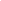

# Observability

Four surfaces cover "what is happening on this panel right now":
Dashboard, Security overview, Threats, and Logs. Plus GeoIP
enrichment to turn IPs into something you can reason about.

## Dashboard

Home tab, entry point. Cards:

- **Traffic** — requests over the last 24 h, bucketed by hour, with
  status-class colouring (2xx / 3xx / 4xx / 5xx).
- **Security** — blocked requests (CrowdSec + WAF + rate-limit)
  over the same window, with a world map of attacker origins and a
  top-IPs table.
- **Health** — DB size, goroutine count, notification queue depth,
  last backup status, panel uptime.

{ loading=lazy alt="Dashboard with traffic sparkline, security map of attacking IPs, and panel health card" }

All cards poll `/api/dashboard/*` on a ~30 s cadence. No SSE.

## Security overview

`/api/security/overview` aggregates the per-host security posture:

- WAF enabled count, mode distribution across hosts.
- Rate-limit enabled count.
- ForwardAuth enabled count.
- Cert expiry stats (expiring soon, renewal recent failures).

Rendered as `/security` tab. One glance to see which hosts are
"on" for each protection layer.

## Threats

`/threats` tab drives the CrowdSec integration. Two sub-tabs:

- **Decisions** — active LAPI decisions list (IP, scenario,
  duration, origin). Add / delete via the UI. Full reference:
  [CrowdSec](crowdsec.md).
- **Status + Scenarios** — LAPI reachability, enrollment state,
  installed collections with counts.

## Logs

`/logs` is the workhorse. Three log sources are ingested into
`log_entries` and surfaced through the same filter UI:

| Source | Origin |
|---|---|
| `caddy_access` | Caddy's structured access log. |
| `caddy_error` | Caddy's error log. |
| `audit` | argos' own mutations (`config_change`, login events, etc.). |
| `waf_audit` | Coraza audit entries. Same table, separate source. |

### Filters

Everything is AND together. Supported filters:

- `source IN (...)`
- `host_id IN (...)` / `host_domain IN (...)` — OR-joined so WAF
  audit rows that only carry host_domain still match.
- `rule_id IN (...)` (the argos Rule, not CRS).
- `status` — `200`, `4xx`, `500-504`, `200,301`.
- `method` — GET / POST / ...
- `path` — substring match, or `re:<regex>` for regex.
- `remote_ip` — substring. CIDR is evaluated at the API edge.
- `level` — info / warn / error / ...
- `query` — free text, LIKE across path + user_agent + message +
  raw.
- `waf_rule_id` (int) + `waf_severity` (CRITICAL / ERROR / ...).

### Tail

With **Live** on, the UI opens an SSE stream (`GET /api/logs/tail`)
that pushes new rows as they land. Each row respects the active
filter. Click **Pause** to freeze; the list stays editable while
paused.

### Stats

**Stats** sub-tab computes aggregates over the current filter:

- Total, by-status-class distribution, by-source distribution,
  avg + p95 duration in ms.
- Top 5 host_domain, Top 5 path.

Useful for answering "what are my 5xx-generating endpoints" or
"which IP hits me the most".

## GeoIP enrichment

Incoming `remote_ip` values get annotated with country + ASN via
the DB-IP Lite databases (CC-BY-licensed free tier). Two mmdb
files under `/data/geoip/`:

- `country.mmdb` — ISO country code + name.
- `asn.mmdb` — AS number + org name.

Enrichment is lazy on the API side — `/api/geoip/lookup?ip=...`
returns the annotated record, and the Dashboard + Logs UIs call
it for rows they render.

The downloader refreshes both files monthly: hardcoded cron
`0 3 5 * *` (day 5 at 03:00 UTC, chosen so DB-IP's 1st-of-month
publish has warmed CDN edges). Manual refresh:
**System → GeoIP → Refresh now** or `POST /api/geoip/refresh`.

Private / LAN addresses short-circuit without DB lookup and
render as country `LAN`, ASN `0`.

{ loading=lazy alt="System GeoIP tab with country and ASN DB versions, last refresh timestamp, and a Refresh now button" }

## Retention

`log_entries` has two retention knobs:

- `logs.retention_days` — default 30. Rows older than this are
  dropped on the retention cron (runs every 6 h, plus once at
  boot).
- `logs.max_entries` — default 500 000. If the retention-by-age
  pass left more rows than this, the oldest are dropped down to
  the cap.

Audit rows share the cap. Tight retention on a chatty WAF host
can evict audit trails faster than you want; bump the cap or
lengthen retention if forensics matter.

## /system/health

The rich one. Not surfaced as a primary UI tab but exposed at
`GET /api/system/health`:

- Memory: Alloc / Sys / GC count.
- Goroutines.
- DB: open connections, idle, in use + file sizes (`argos.db` and
  WAL).
- Workers: notification queue depth + capacity + dropped count.
- Scheduler: last backup timestamp + status.
- Panel: mode, domain, uptime seconds.

Wire to an external uptime monitor that alerts on non-200 or on
`memory.Alloc > X`.

## What is NOT observable

- **No Prometheus endpoint.** Metrics are computed on-demand from
  SQL queries. For external alerting, drive off `/system/health`
  JSON + the notification webhook channel.
- **No per-user traffic aggregation.** Logs do not carry session
  ids.
- **No trace / span correlation.** Single-request ids exist in
  Caddy's access log but argos does not propagate them into the
  audit layer.

## Related

- [Monitoring](../operations/monitoring.md) — day-two posture,
  what to watch, when to alert.
- [Notifications](notifications.md) — how observability becomes
  pings.
- [Reference / API](../reference/api.md) — exact endpoint list.
