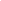

# Security overview

`/security` is the single-glance view of every host's protection
posture. One card row for totals, one table row per host for
per-domain state. Auto-refreshes every 30 s.

Use this page when you want to answer "is everything covered?"
without clicking through hosts one by one.

## The four KPI cards

Across the top, four counters aggregated over your whole host list:

| Card | Value | Source |
|---|---|---|
| **WAF enabled** | `<block + detect> hosts` with a sub-line breaking the total into `<block> · <detect> · <off>` | `host_security.waf_enabled + waf_mode` |
| **Rate limited** | `<n> hosts` with rate limiting on | `host_security.rate_limit_enabled` |
| **Blocked 24h** | Total blocked requests across all hosts in the last 24 h | WAF + rate-limit counters |
| **Critical alerts 24h** | Count of critical-severity events delivered through Notifications in the last 24 h | `notification_deliveries` |

The last two cards render in red so a non-zero number jumps out when
you open the page.

## Per-host table

One row per host, sorted by domain:

| Column | What it shows |
|---|---|
| **Domain** | The host's domain (monospace) |
| **WAF** | Badge: `off` (slate), `detect` (amber), `block` (red) |
| **Paranoia** | CRS paranoia level 1..4, or `—` when WAF is off |
| **Rate limit** | Badge: `on` (sky) / `off` (slate) |
| **Blocked 24h** | Count of blocks attributed to this host in the last 24 h |
| **Last triggered** | Relative timestamp of the most recent WAF / rate-limit hit. Hover for the absolute time |
| **Actions** | Two buttons: **Configure** and **Logs** |

- **Configure** jumps to `/hosts/<id>/security` — the per-host
  security editor where you flip WAF mode, tune paranoia, set
  rate-limit windows, add CRS rule exclusions, and write custom
  SecRules. See [WAF](waf.md).
- **Logs** opens `/logs?source=waf_audit&host_id=<id>` — the logs
  browser pre-filtered to WAF audit entries for this host. See
  [Logs browser](logs-browser.md).

## Where it fits

- **`/appsec`** controls the WAF's global posture (off / detect /
  block). The Security overview reflects each host's per-host override
  of that global mode.
- **`/hosts/<id>/security`** is where you make changes. The overview
  is read-only — it points you at the host that needs attention and
  the logs that explain why.
- **`/logs`** is where you drill into the specific events behind a
  non-zero `Blocked 24h` count.

## When to open it

- Morning check: do all hosts that should have WAF enabled have it
  enabled? Did any slip to `off` overnight?
- After a deploy: new host shows up — confirm its WAF + rate-limit
  settings landed as intended before you take it public.
- During an incident: the `Blocked 24h` column tells you at a glance
  which host is under fire. See [Respond to an attack](../workflows/respond-to-attack.md).

{ loading=lazy alt="Security tab with WAF Enabled, Rate Limited, Blocked 24h, Critical Alerts KPI cards and a per-domain table with WAF mode, paranoia, rate limit, blocked count, last triggered, and action buttons" }

## Related

- [WAF](waf.md) — Coraza / CRS internals, modes, exclusions.
- [Logs browser](logs-browser.md) — drill-down for the per-host
  `Logs` action.
- [Observability](observability.md) — the wider set of dashboards.
- [Respond to an attack](../workflows/respond-to-attack.md) — the
  playbook that uses this view first.
