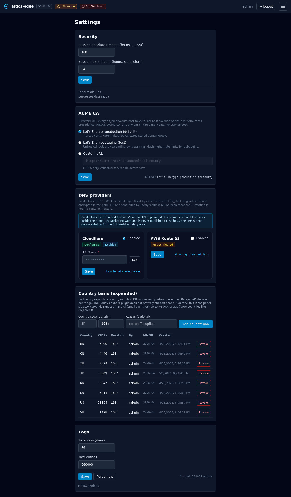

# Settings

`/settings` holds the knobs that don't fit on a feature page of
their own: session-cookie timeouts and the log-retention controls.
Other configuration (backups, SSO, 2FA, GeoIP, appsec mode, per-host
security) lives under **System** or the dedicated feature tab.

The page is narrow on purpose — two sections, short forms, a
purge button. Everything writes to the `settings` table via
`PUT /api/settings/<key>`; changes take effect on the next request
(no restart).

## Security section

Session cookie lifetimes. Both are stored in hours and validated
before save.

### Session absolute timeout

- Key: `session.absolute_timeout_hours`
- Range: **1..720 hours** (1 hour to 30 days)
- Default: **168** (7 days)

The hard ceiling on any session, regardless of activity. Even an
actively-used session logs out after this window.

### Session idle timeout

- Key: `session.idle_timeout_hours`
- Range: **1..absolute_timeout_hours** (cannot exceed the absolute
  timeout)
- Default: **24**

The inactivity cutoff. A session that has not seen a request in N
hours lapses and the user is bounced to `/login`.

The form validates `idle ≤ absolute` client-side before sending —
an invalid combination surfaces a red toast and is not written.

### Read-only info

Below the save button, three lines of context that are informational
only:

- **Panel mode** — `lan` or `behind_caddy`, sourced from
  `ARGOS_PANEL_MODE`.
- **Panel domain** — the configured `ARGOS_PANEL_DOMAIN` when set.
- **Secure cookies** — `true` when `panel_mode=behind_caddy`, `false`
  in LAN mode. Not a toggle; set by panel mode.

These are not editable here — they come from environment variables
at container start. See [Env vars reference](../reference/env-vars.md).

## Logs section

Log retention + on-demand purge. Applies to every source stored in
`log_entries` (Caddy access, Caddy error, audit, WAF audit).

### Retention (days)

- Key: `logs.retention_days`
- Range: **1..365**
- Default: **30**

The nightly purge job (and the **Purge now** button below) delete
any row older than N days. No soft-delete, no archive — if you need
history beyond retention, export to CSV from [Logs browser](logs-browser.md)
before the purge runs.

### Max entries

- Key: `logs.max_entries`
- Range: **10,000..5,000,000**
- Default: **500,000**

A ceiling on the table regardless of age. When the table exceeds
this count, the oldest rows are evicted on the next purge. Useful
if you have a burst (ingest attack, crawler spree) that would
otherwise push retention past what the volume can hold.

The two limits compose — **whichever fires first wins**. A 30-day
retention plus a 500 k cap means: keep 30 days of logs, unless that
exceeds 500 k rows, in which case drop the oldest regardless of age.

### Purge now

Runs the same retention job on demand. Useful:

- After tightening retention — the next scheduled purge is hours
  away and you want the cleanup immediately.
- After a massive ingest event (scanner burst, misbehaving upstream
  spamming 500s) before the table growth affects query latency.

A browser `confirm()` dialog guards the click — the purge is NOT
reversible. A toast reports the number of rows removed on success.

### Current entries counter

Bottom-right of the Logs form. Reads
`Current: <n> entries` live, re-queried after each save and after
each purge so the number reflects the post-action state.

### Raw settings

A collapsed `
` block at the bottom prints the full
`logs.*` setting rows as JSON. Useful when you need to eyeball keys
that are not exposed as form fields (cron expressions, internal
toggles) or when writing a script that hits
`PUT /api/settings/<key>` directly. Treat it as read-only inspection,
not an editor.

{ loading=lazy alt="Settings tab with Security section showing session absolute timeout and idle timeout fields plus panel mode / secure cookies info, and a Logs section with retention days, max entries, save and Purge now buttons" }

## ACME CA section

The **ACME CA** block on this same page (added in v1.0.1) controls
which ACME directory URL every `tls_mode=auto` host uses. Full
documentation: [Reverse proxy → ACME CA options](reverse-proxy.md#acme-ca-options).
Shortcut: flip to staging during development to avoid burning LE
production rate limits; flip back to production when shipping.

## Related

- [Logs browser](logs-browser.md) — where the retention settings
  apply. CSV-export before purge if you need the history.
- [Observability](observability.md) — the full view of what lands in
  `log_entries`.
- [Env vars reference](../reference/env-vars.md) — the read-only
  context shown in the Security section.
- [Tuning](../operations/tuning.md) — when to bump retention vs
  max-entries on a busy panel.
