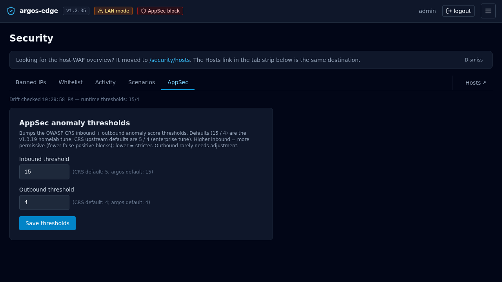

# WAF

Argos integrates an inline Coraza + OWASP CRS WAF via the CrowdSec
AppSec component. Three runtime modes, per-host opt-in,
per-host-per-rule exclusions, and per-host custom SecRule text.

!!! info "Looking for setup or fail-policy?"
    This page covers rules, exclusions, paranoia levels, and the
    metrics dashboard. For the install path (AppSec collections are
    not enabled in the stock CrowdSec image), the LAPI-vs-AppSec
    distinction, and the `appsec.fail_open` setting, see
    [AppSec (CrowdSec WAF-inline)](appsec.md).

## Architecture

```
                Caddy receives request
                         |
          CrowdSec bouncer pre-check (external IP bans)
                         |
          [AppSec round-trip if WAF enabled on host]
                         |
               Rules + Rate limit (host_security)
                         |
                  reverse_proxy to upstream
```

The AppSec component is a separate HTTP listener inside the
CrowdSec container: `:7423` for detect mode, `:7422` for block
mode. Caddy calls one of the two per request when the host's WAF
is enabled, and forwards the upstream request only if AppSec
returns a clear verdict.

## Runtime modes

One setting, `appsec.mode`, switches the whole panel's AppSec
behaviour:

| Mode       | Caddy config emitted                  | Effect |
|------------|---------------------------------------|--------|
| `detect`   | forwards to `:7423`                   | Rules match, events log, request still proceeds. Default. |
| `block`    | forwards to `:7422`                   | In-band match returns 403 from the bouncer. |
| `disabled` | omits the appsec_url entirely         | No WAF round-trip. No overhead. No protection. |

Change via **System → Settings → AppSec mode**, or the
`PATCH /api/appsec/mode` endpoint. Reconciler regenerates Caddy's
config on save; no restart needed.

## Per-host enable

The panel-wide `appsec.mode` only takes effect on hosts that have
opted in. **Hosts → *your host* → Security → WAF enabled** is the
opt-in flag. Combine the two:

| `appsec.mode` | host `waf_enabled` | Outcome |
|---|---|---|
| `disabled`    | any   | No WAF. |
| `detect`      | off   | No WAF on this host. |
| `detect`      | on    | Detect, log, proceed. |
| `block`       | off   | No WAF on this host. |
| `block`       | on    | Block on match. |

The common operational pattern: ship new hosts with `waf_enabled=on`
from day one, run the panel in `detect` for the first 24-48 h,
flip to `block` once the AppSec metrics are clean.

## Paranoia level

Per-host, 1-4:

- **1** — default, minimal false positives, catches obvious attacks.
- **2** — adds stricter checks (path traversal heuristics, more
  aggressive SQLi detection).
- **3** — catches edge cases, substantial FP rate.
- **4** — aggressive; only for hosts with well-known, stable traffic
  patterns.

Most homelabs never move past 1.

## Block response shape

When the WAF mode is `block` and a match fires, AppSec returns a
code that Caddy surfaces as the configured block status (default
`403`) with the configured block body. Both fields live in
`host_security`:

- `waf_block_status` — int, default 403. Anything valid HTTP.
- `waf_block_body` — string, default empty. Shown as the response
  body.

## Exclusions

Per-host, per-rule, optionally scoped to a path pattern.

**Hosts → *your host* → Security → Exclusions → New**:

- CRS rule ID (int from the WAF audit log).
- Path pattern (empty = applies everywhere, non-empty = scoped).
- Reason (free text).
- Enabled toggle.

Prefer narrow exclusions. `path=/api/upload + rule=920420` beats
`rule=920420 everywhere`.

## Custom rules

Per-host free-form SecRule text. Written directly in the Coraza
SecLang dialect:

```
SecRule REQUEST_URI "@contains /admin" \
    "id:9999,phase:1,deny,status:403,log,msg:'admin path probe'"
```

Managed in **Hosts → *your host* → Security → Custom rules**. IDs
in the 9xxxx range are the recommendation to avoid collisions with
the CRS namespace.

Syntax errors are caught at reconcile time and the push to Caddy
fails; the panel surfaces the error on the next save attempt.

## Finding what is matching

**Logs** tab with filter `source = waf_audit` surfaces every WAF
audit entry. Useful columns:

- `waf_rule_id` — the CRS (or custom) rule number.
- `waf_rule_message` — the rule's `msg:` field.
- `waf_severity` — `CRITICAL` / `ERROR` / `WARNING` / `NOTICE`.
- `waf_anomaly_score` — sum of anomaly scores for the request.
- `path` / `remote_ip` / `user_agent` — the usual.

Bursts of matches with the same rule ID on the same path + User-
Agent from one IP = an attacker. Bursts on your own legit paths =
a false positive.

## Metrics

**AppSec** tab aggregates over a rolling window (1h / 6h / 12h /
24h, selectable):

- Hits per rule.
- Severity distribution.
- Top paths that triggered rules.
- Top blocked IPs (in block mode).

{ loading=lazy alt="AppSec tab with mode selector and a table of rules with hits and severity" }

## Limitations

- **No request body inspection past the limit** — Caddy buffers up
  to a configured body size before handing to AppSec; larger
  bodies are streamed and the WAF sees only the beginning. Tune
  via Caddy's `max_request_body` if you change defaults.
- **No rule chain editor** — if you need to write multi-step
  Coraza rules with chain semantics, write them in the custom
  rules text field. The UI does not decompose chains.
- **No per-method exclusions** — exclusions are scoped by path +
  rule ID, not method. Use a custom rule with a method matcher if
  you need method-granular exceptions.

## Related

- [CrowdSec](crowdsec.md) — external IP bans (fires BEFORE WAF).
- [Reverse proxy](reverse-proxy.md) — where `host_security`
  connects to the edge pipeline.
- [Respond to an attack](../workflows/respond-to-attack.md) —
  operational playbook.
