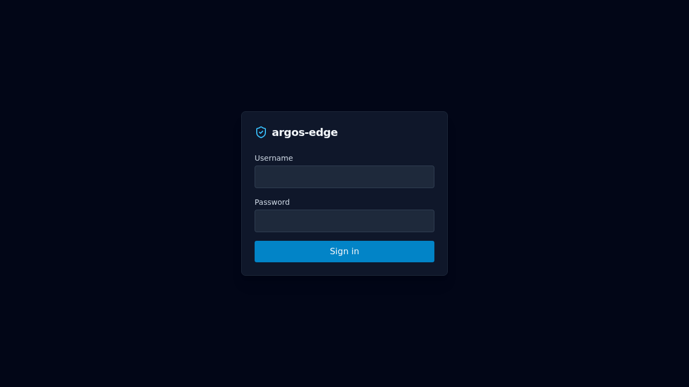
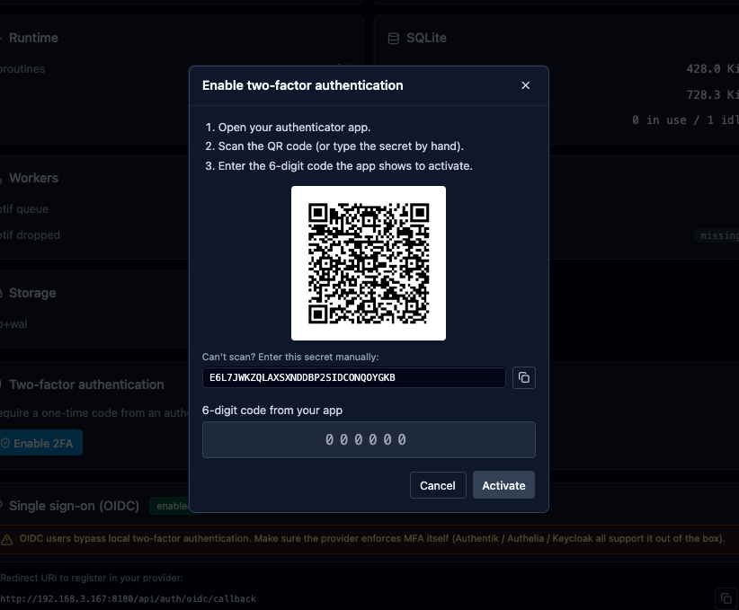
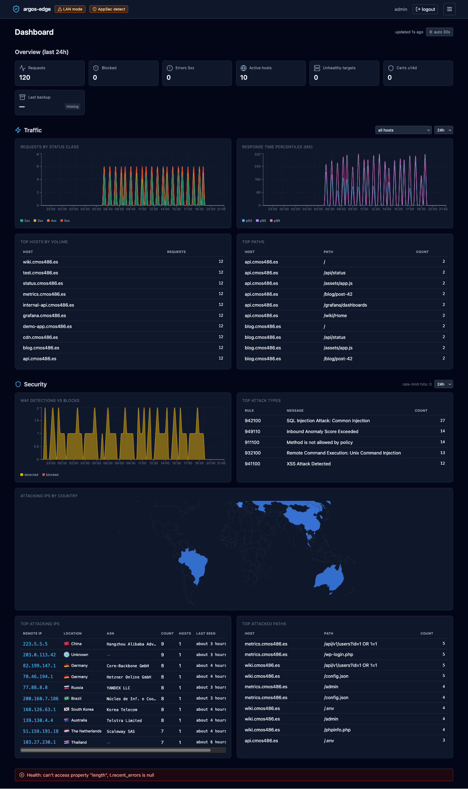

# First run

What to do once `docker compose up -d` reports every container
healthy and you have a panel you can reach. This page is the
"opening-day checklist" — not a full tutorial. The deeper workflows
live under [Workflows](../workflows/index.md).

## 1. Log in

Open the panel URL (`http://<lan-ip>:8080/` for LAN mode or
`https://$ARGOS_PANEL_DOMAIN/` for behind_caddy) and sign in with the
bootstrap admin. The credentials are whatever you put in
`ARGOS_INITIAL_ADMIN_USER` (default `admin`) and
`ARGOS_INITIAL_ADMIN_PASSWORD` in `.env`.

{ loading=lazy alt="Argos login form with username and password fields" }

If the login screen never appears, see
[Troubleshooting](../operations/troubleshooting.md).

## 2. Turn on 2FA

The local admin is the break-glass entry to the panel. Add TOTP so
a stolen password alone cannot unlock it.

Open **System → Two-factor authentication** and click
*Enable 2FA*. Scan the QR with Aegis / 1Password / Google
Authenticator, type the 6-digit code, and **save the recovery codes
before closing the dialog** — the panel will never show them again.

{ loading=lazy alt="Two-factor setup dialog with QR code, manual secret, and 10 recovery codes" }

Full flow: [Local auth](../features/auth-local.md).

## 3. Review the system settings

Not every default is wrong, but you will probably want to change a
few right after the first boot:

- **System → Settings → Session timeouts.** Defaults are 168 h
  absolute + 24 h idle. Tighten for shared devices.
- **System → Settings → Logs retention.** Default 30 days / 500 k
  entries. Raise if you have ingest headroom and forensics matter.
- **System → Notifications.** Wire at least one channel (webhook or
  email) before any alert worth receiving fires.
- **System → Backups.** Default cron is `0 2 * * *` with 14-day
  retention. Confirm the `/data/backups/` volume has disk.

## 4. (Optional) Configure OIDC

If you want SSO for yourself *and* for the services you will put
behind argos, do this before adding hosts — the cookie_parent_domain
setting affects the cookie shape that ForwardAuth-protected hosts
will receive.

Full setup (Google, Microsoft, Keycloak, Authentik, Authelia):
[OIDC SSO](../features/auth-oidc.md).

## 5. Add your first host

The main event. The playbook is
[Add a host](../workflows/add-host.md). Ten-minute version:

1. Target group with the upstream IP/port.
2. Host with the public domain + target group + TLS auto.
3. `curl https://<domain>/` and watch the panel's **Logs** tab.

If the cert issuance fails, the most common cause is DNS pointing
at something other than your host; see
[Troubleshooting](../operations/troubleshooting.md).

## 6. Look at the dashboard

**Dashboard** shows traffic, attack signal aggregates, the world map
of offending IPs, and the top 4xx/5xx paths. It is where you look
every morning.

{ loading=lazy alt="Argos dashboard with traffic sparkline, attacks by country map, and top offending IPs table" }

## 7. Before you walk away

- Confirm a backup has actually run: **Backups** tab, watch for the
  first scheduled entry after the cron fires. Trigger a manual run
  to de-risk day zero.
- Confirm CrowdSec is enrolled (if you want community blocklist
  pulls). Settings snapshot + enrollment process:
  [CrowdSec](../features/crowdsec.md).
- Note down the panel URL, the bootstrap admin credentials, the
  recovery codes, and the location of the `.env` in whatever
  password-manager / safe you use for ops. **All four are needed to
  recover** the panel from a worst-case loss.

Done. The rest of the site is fluff now; come back as needed.
