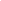

# Quickstart

Zero to first host in ten minutes. Assumes you have Docker + a host
with outbound internet + a DNS name you control.

## 1. Stack up (2 min)

```bash
git clone https://github.com/cmos486/argos-edge.git
cd argos-edge
cp .env.example .env

# Mandatory: set three secrets.
cat <<EOF >> .env
ARGOS_SESSION_SECRET=$(openssl rand -hex 32)
ARGOS_MASTER_KEY=$(openssl rand -hex 32)
ARGOS_INITIAL_ADMIN_PASSWORD=change-me-before-you-log-in
EOF

docker compose up -d
```

After a few seconds, `docker compose ps` should show `argos`,
`caddy`, and `crowdsec` as `healthy`.

## 2. Log in (1 min)

LAN mode (default) lives at `http://<host-ip>:8080`. Log in with
`admin` + the password you set.

Enable TOTP right away: **Settings → Two-factor authentication →
Enable 2FA**, scan the QR, save the recovery codes.

## 3. Point a DNS name at the host (1 min, out-of-band)

Create an `A` record for the domain you want to expose, pointing at
the public IP of the host running argos. Let's Encrypt will resolve
this on the first request.

Example: `myapp.example.com  A  203.0.113.7`.

Skip this step if you are testing with a purely internal service —
you will have to use the `tls_mode=none` path and serve over plain
HTTP. This guide assumes you want a cert.

## 4. Create a target group (2 min)

Target groups decouple the public name from the upstream. Even if you
only have one backend, the panel needs the indirection.

**Target Groups → New target group**:

- Name: `myapp`
- Protocol: `http` (set to `https` if your upstream already terminates
  TLS — argos will then verify unless you untick *Verify upstream TLS*)
- Algorithm: `round_robin` (single target, anything works)
- Health check: leave disabled for the first pass

Save. Open the new group and click **Add target**:

- Host: `10.0.0.42` (LAN IP of your backend)
- Port: `8080`
- Weight: `1`
- Enabled: yes

{ loading=lazy alt="Target group detail page with one target listed at 10.0.0.42:8080" }

## 5. Create the host (1 min)

**Hosts → New host**:

- Domain: `myapp.example.com`
- Target group: `myapp`
- TLS mode: `auto` (Let's Encrypt via HTTP-01)
- TLS email: your contact address
- Enabled: yes

Save. Caddy picks up the change within a couple of seconds.

## 6. Test (1 min)

```bash
curl -v https://myapp.example.com/
```

First request takes a few seconds while Let's Encrypt issues the
cert. Subsequent requests are fast. If the cert issuance hangs, the
most likely cause is the DNS record not propagating yet or port 80
blocked upstream of the host.

Watch the request land in the panel:

- **Logs** tab, source filter `caddy_access`. The row should show
  your `curl` with its User-Agent and response status.
- **Certs** tab, look for `myapp.example.com` with a not-after
  timestamp 90 days out.

## 7. You now have a working edge

What you skipped that you should come back to within the first week:

| Topic                                          | Link |
|------------------------------------------------|------|
| Turn on the WAF for this host                  | [WAF](../features/waf.md) |
| Put the host behind OIDC SSO                   | [Publish with SSO](../workflows/publish-with-sso.md) |
| Add a second backend for HA                    | [Reverse proxy](../features/reverse-proxy.md) |
| Wire Slack or email notifications              | [Notifications](../features/notifications.md) |
| Trigger the first backup manually              | [Backups](../features/backups.md) |
| Enrol CrowdSec for community threat blocklists | [CrowdSec](../features/crowdsec.md) |

Full add-host walkthrough with every optional tab covered:
[Add a host](../workflows/add-host.md).
