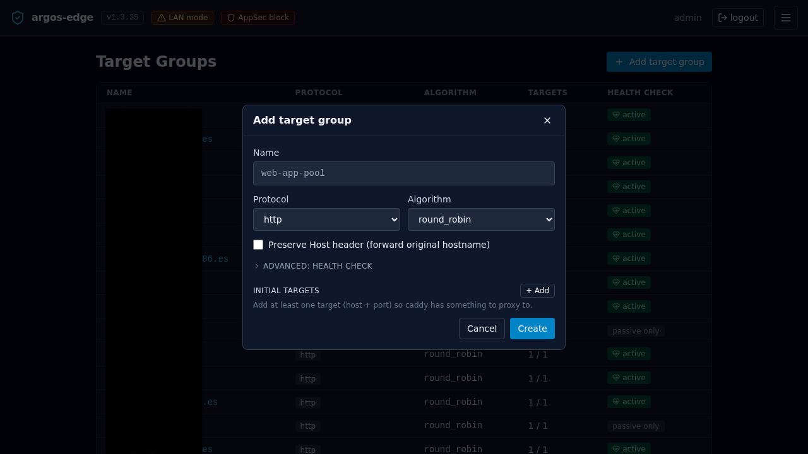
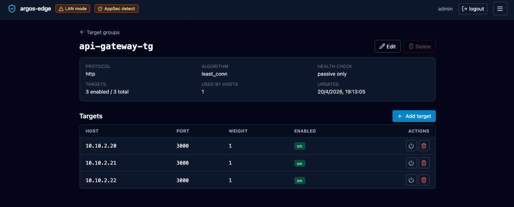
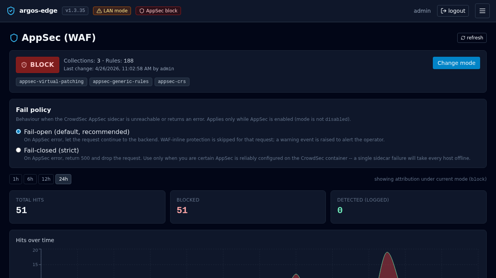

# Add a host

End-to-end: from a service sitting on your LAN to a public-facing
host with TLS, optionally WAF-protected and optionally behind SSO.
The minimum is steps 1-5; the rest are optional hardening that you
can layer on without re-creating anything.

## 0. Pre-flight checklist

Before you touch the panel:

- **DNS** record (`A` or `AAAA`) for the target domain resolves to
  the public IP of the host running argos. The record has to be
  live at the time of the first request, or the ACME challenge
  fails. `dig +short myapp.example.com` should answer with your
  host's IP.
- **Backend reachable from argos**: `docker compose exec argos wget
  -qO- http://10.0.0.42:8080/` (or whatever your backend is) should
  return content. Firewalls between argos and the upstream bite
  silently here.
- **Ports open for the challenge you plan to use.** See
  [TLS challenges](../features/reverse-proxy.md#tls-challenges) for
  the full matrix. Briefly:
    - **DNS-01** (default): no inbound ports required; a
      `CLOUDFLARE_API_TOKEN` on the caddy container is.
    - **HTTP-01**: port 80 reachable from the internet.
    - **TLS-ALPN-01**: port 443 reachable from the internet.

## 1. Create a target group

Target groups decouple the public host from the backend set. Even if
you only have one backend today, you create the group first — the
host selector needs something to attach to.

**Target Groups → New target group**:

- **Name** — human label. `myapp` or `myapp-prod`. Must be unique.
- **Protocol** — `http` if the backend speaks plain HTTP (most
  homelab services), `https` if it already terminates TLS with a
  valid cert.
- **Verify upstream TLS** — only meaningful for `https`. On = reject
  self-signed. Off = accept. Default on; flip off for the typical
  homelab backend with a self-signed cert.
- **Algorithm** — `round_robin` (default, correct for most homelabs),
  `least_conn` (bias new connections to the least-busy target),
  `ip_hash` (session-stickiness by client IP), `random` (rare).
- **Health check** — leave off for the first pass; turn on once the
  group has 2+ targets. Covered below.

Save.

{ loading=lazy alt="Target group creation form with name, protocol, verify TLS, algorithm, and health check fields" }

### 1b. (Optional) Health checks

Open the new group. Toggle **Health check enabled**:

- **Path** — `/healthz`, `/health`, or whatever your backend exposes.
- **Method** — `GET` or `HEAD`. `POST` is allowed too but almost
  never what you want.
- **Expect status** — `200` for a single code, `200,204` for a CSV
  list, or `200-299` for a range. Caddy's active health check honours
  all three forms.
- **Interval seconds** — 30 is the default and fine.
- **Timeout seconds** — 5 default. Raise for slow health endpoints.
- **Fails to unhealthy** / **Passes to healthy** — 2 / 2 default.
  Raise fails-to-unhealthy if your backend flaps under load.

Passive health checks (3 fails → 30 s cooldown) are always on; the
active toggle is layered on top.

## 2. Add targets

Same page, **Add target**:

- **Host** — IP literal (`10.0.0.42`) or DNS name (`backend.lan`).
  Must be reachable from the argos container. IPv6 needs brackets
  in URL form but the Host field accepts the bare address.
- **Port** — 1–65535.
- **Weight** — default 1. Raise for a target that should take more
  traffic (e.g. 2 vs 1 = 2:1 split on round-robin).
- **Enabled** — leave on. Disabled targets stay in the group but
  Caddy stops routing to them; useful for a drain.

Repeat for every backend. Save.

{ loading=lazy alt="Target group detail page listing two targets each at a different LAN address" }

## 3. Create the host

**Hosts → New host**:

- **Domain** — the public name. Exactly what resolves via DNS.
- **Target group** — select the one you just made.
- **TLS mode** —
    - `auto` (default): Caddy provisions a Let's Encrypt cert
      automatically on first request.
    - `none`: serves HTTP only. Used for internal names or testing.
    - `manual`: upload your own cert + key; argos never touches
      ACME for this host. See
      [Import own cert workflow](import-own-cert.md).
- **TLS challenge** (only when mode is `auto`) —
    - `DNS-01` (default): works behind CGNAT, supports wildcards.
      Requires a DNS provider configured in
      [Settings → DNS providers](../features/dns-providers.md).
    - `HTTP-01`: port 80 reachable from the internet; no wildcards.
    - `TLS-ALPN-01`: port 443 reachable from the internet; no
      wildcards.
  See [TLS challenges](../features/reverse-proxy.md#tls-challenges)
  for the decision matrix.
- **DNS provider** (only when TLS challenge is `DNS-01`) — the panel
  reads encrypted credentials from the `dns_providers` catalogue for
  the selected provider and streams them inline to Caddy at reconcile
  time. If exactly one provider is enabled in Settings, it is
  auto-selected and the field shows "Using &lt;provider&gt;". If
  multiple are enabled, a dropdown picks between them. If none are
  enabled, an amber warning points you at Settings and Save is
  blocked. See [DNS providers](../features/dns-providers.md).
- **TLS email** — contact for ACME. Let's Encrypt uses it for
  expiry reminders. Required when TLS mode is `auto`.
- **Enabled** — on.

Save. The reconciler pushes the new config to Caddy within a second.

{ loading=lazy alt="Host creation form with domain, target group, TLS mode, TLS email, and enabled toggle" }

## 4. Verify

From another machine:

```bash
curl -v https://myapp.example.com/
```

First response may take a few seconds while Caddy completes the ACME
exchange. Subsequent responses are fast.

In the panel:

- **Logs** tab, filter `source = caddy_access`. Your curl should
  show with its User-Agent, status, and upstream. If it does not,
  Caddy never saw the request — DNS or firewall problem.
- **Certs** tab, row for the new domain with a `not_after` about 90
  days in the future.
- **Dashboard** traffic card bumps on the next refresh.

## 5. (Optional) Turn on the WAF

The Coraza / OWASP CRS WAF runs via the CrowdSec AppSec component.
Argos has three modes plus a per-host enable flag:

1. **Hosts → *your host* → Security**. Toggle *WAF enabled*.
2. First run with **Mode = detect**. This logs matches but does not
   block. Leave it for a day or two and watch **AppSec** tab:
    - False positives show up as recurring rule IDs on your own
      traffic.
    - Real attacks show up once every few minutes on most
      internet-exposed hosts.
3. For false positives, add **WAF exclusions** (same page). Scope
   them to the path pattern and CRS rule ID that fired. Prefer
   narrow exclusions (`path=/api/upload` + rule `920420`) over
   disabling a whole category.
4. When **AppSec → metrics** is quiet for a day, flip the host's
   WAF **Mode to block**. In-band matches now return 403.

Full reference: [WAF](../features/waf.md).

{ loading=lazy alt="AppSec metrics tab showing hits per rule and severity distribution" }

## 6. (Optional) Put the host behind SSO

Only works after the panel itself has OIDC configured. If you have
not done that yet:
[Publish with SSO](publish-with-sso.md). Quick version:

1. Panel **System → Single sign-on** has a valid OIDC client +
   issuer + the **Cookie parent domain** set to the parent of both
   the panel and this new host (e.g. `example.com` for
   `panel.example.com` + `myapp.example.com`).
2. **Hosts → *your host* → Auth required** toggle on.

Every request to `myapp.example.com` now goes through ForwardAuth
against the panel. Without a valid session cookie the user is 302'd
to the panel's login and back on success.

## 7. (Optional) Add Rules for per-path behaviour

**Hosts → *your host* → Rules** lets you override the default
target-group dispatch per path / header / matcher. Five action
types are available:

| Action | Use for |
|---|---|
| `forward` | Route to a *different* target group for this match. E.g. `/admin/*` → admin-only backend. |
| `redirect` | HTTP 301/302/307 to another URL. |
| `fixed_response` | Return a canned status + body. Handy for maintenance pages. |
| `block` | Return 403 for requests that match. Use for IP blocklists or path blacklists. |
| `rewrite` | Internal path rewrite before forwarding. |

Rules evaluate in priority order (low first), and the first match is
terminal. Unmatched requests fall through to the host's default
target group.

!!! note "Rate limiting is per-host, not per-rule"
    Argos does not have a `rate_limit` rule action. Rate limiting
    lives at the host level under **Hosts → *your host* → Security
    → Rate limit**, keyed by IP / header / global. If you need
    per-path quotas, split the paths into different hosts or wait
    for a future version.

## 8. (Optional) Active rate limiting

**Hosts → *your host* → Security → Rate limit enabled**:

- **Requests** per **Window seconds**. `300 / 60` = 300 rpm.
- **Key** = `ip` (per remote IP), `header` (per value of a named
  header), or `global` (one bucket for every client).
- **Status** returned on limit hit — 429 default.

Caddy enforces this in front of the WAF and upstream.

## 9. Monitoring ongoing

Day-two knobs:

- **Dashboard → Security overview**: attack signal aggregates for
  this host and the full panel.
- **Threats** tab: CrowdSec decisions currently active against IPs
  that have hit your hosts.
- **Logs** tab: any request you want to dig into. Filter by
  `host_domain = myapp.example.com` + `source = waf_audit` to see
  WAF hits, `source = caddy_access` for traffic, `level = error` +
  `source = caddy_error` for upstream problems.
- **Notifications**: wire a rule so you find out about WAF bursts /
  cert renewal failures / target down events the same way you find
  out about other things, not by refreshing the dashboard. See
  [Notifications](../features/notifications.md).

## Rollback

Delete a host: **Hosts → *row* → Delete**. Caddy drops the config on
the next reconcile; the cert stays in `caddy_data` for a while and
is reaped on its next scheduled renewal.

Disable without deleting: toggle the **Enabled** switch off. Caddy
returns a 404 for the host until you flip it back.

Delete a target group: you cannot delete one that any host
currently references. The panel will surface the blocking host IDs
so you can retarget first.
