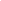

# Onboard an admin

Add a second human that can operate the panel. Argos has no in-UI
"create user" form; local accounts are provisioned via the
`ARGOS_INITIAL_ADMIN_*` env-var bootstrap (which only fires once, at
first boot). Everything after the first admin happens through OIDC
auto-provisioning.

## Before you start

- OIDC is already working: [OIDC SSO](../features/auth-oidc.md).
- You know the new admin's email address.
- You know what email domain their IdP will send (Google will send
  `@example.com`, Microsoft may send a different UPN, etc.). If in
  doubt, have them log in once with the allowlist wide open, look at
  their row in Users, then tighten the allowlist.

## 1. Add the email to the OIDC allowlist

**System → Single sign-on → Allowed emails**, add the new admin's
email on its own line. Save.

If you already operate with an allowed-domain list
(`@example.com`) and the new user is under the same domain, they
are already covered — skip this step.

{ loading=lazy alt="System Single sign-on panel with the Allowed emails textarea focused, showing one address per line" }

## 2. Leave auto-provision on

**System → Single sign-on → Auto-provision new users on first
login** should be **on** (default). With it off, the first time the
new admin hits `/login` via the IdP, argos rejects them with
`no_auto_provision` and you have no way to create the row short of
direct SQL.

## 3. Tell the admin to log in

They browse to the panel and click **Sign in with SSO**. The IdP
walks them through whatever MFA/consent is configured. On the
callback:

1. Argos sees a first-time sub, matches the email against the
   allowlist.
2. Creates a row in `users` with `external_provider='oidc'`,
   `external_id=<sub>`, no password hash, `created_via='oidc'`.
3. Mints a session cookie and redirects to `/`.

They are now a panel admin with the same access as the bootstrap
admin.

## 4. Turn on email verification if you have not already

**System → Single sign-on → Require verified email from provider**
= on.

This is opt-in but strongly recommended: without it, an IdP
(especially a public one like Google) that accidentally or
maliciously emits a claim with `email_verified=false` could land an
unverified identity in your panel. Safe to enable against Google,
Microsoft, Keycloak, Authentik, Authelia — they all mark
user-verified addresses as verified and unverified ones as not.

With the flag on, the callback rejects unverified claims before the
allowlist check so no identity that cannot prove the email gets in.

## 5. 2FA story

OIDC-provisioned users **bypass** argos' own TOTP. The reasoning:
the IdP is already the authoritative MFA layer for the user; adding
a second TOTP inside argos is redundant and harms UX.

What this means in practice:

- Make sure the IdP enforces MFA. Authentik, Authelia, Keycloak all
  support it; Google Workspace and Microsoft 365 enforce it via
  admin policy.
- If the IdP has no MFA, the argos account also has no MFA.
- If you want the belt-and-braces of TOTP on top of OIDC, you have
  to either provision the user as a local password account (see
  "Out-of-band" below) or patch the code.

The bootstrap admin is local-only and keeps its TOTP + recovery
codes regardless of OIDC config. That is your break-glass.

## 6. Revoking an admin

Three layers, in order of severity:

1. **At the IdP**: disable / delete the user. Any in-flight argos
   session still works until it expires (absolute TTL, default 7 d,
   or idle TTL, default 24 h). New logins fail because the IdP
   refuses to issue an id_token.
2. **At argos (soft)**: remove the email from the allowlist. Next
   login fails with `not_allowed`. Existing sessions live on until
   expiry.
3. **At argos (hard)**: delete the row in `users`. Existing sessions
   still look up the user on every request (`session.Lookup` JOINs
   users); the foreign-key CASCADE drops the session rows too so
   the user is logged out immediately.

The hard path requires direct SQL today (there is no "delete user"
endpoint). Example:

```bash
docker compose exec argos sh -c "
  sqlite3 /data/argos.db <<SQL
    DELETE FROM users WHERE username='alice-oidc';
SQL
"
```

The FK cascade on `sessions.user_id` REFERENCES `users(id)` ON
DELETE CASCADE handles the session cleanup.

## Out-of-band: creating a local password admin

If OIDC is unavailable (IdP outage, you are bootstrapping a panel
before any IdP exists) and you need a second local admin, the
current options are:

- **Change `ARGOS_INITIAL_ADMIN_USER` + password in `.env` and
  restart** — works only because the bootstrap is idempotent *per
  username*. A user with the new name gets created on next boot.
  Existing admins are untouched. Leaves the bootstrap env var
  pointing at a different name than before.
- **Direct SQL** to insert a row + bcrypt-hashed password. The
  hash has to be computed out of band (`htpasswd -bnBC 12 ""
  hunter2hunter2`). Not operator-friendly.

A UI user-create flow is out of scope for the current version.

## Related

- [OIDC SSO](../features/auth-oidc.md) — full per-provider setup.
- [Local auth](../features/auth-local.md) — password + TOTP
  enrollment, recovery code regeneration.
- [CLI](../reference/cli.md) — `argos disable-2fa` for break-glass
  TOTP reset.
