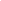

# Publish a host with SSO

Put an existing service behind OIDC so only signed-in humans can hit
it, without touching the upstream's own login. Argos handles the
OIDC dance; Caddy forwards every request to argos for a session
check first and only then to your backend.

## Prerequisites

- OIDC already configured in the panel. If not:
  [OIDC SSO](../features/auth-oidc.md).
- The host already serves traffic without auth (done via
  [Add a host](add-host.md)).
- A **Cookie parent domain** that covers both the panel and the
  target host. Example: panel is `panel.example.com`, target is
  `myapp.example.com`, parent is `example.com`. Without a parent
  domain, the session cookie is scoped to the panel host alone and
  ForwardAuth on the target will see an empty cookie jar.

## 1. Set the parent cookie domain

**System → Single sign-on → Cookie parent domain** = `example.com`.
Save.

This changes the cookie behaviour globally:

- `Domain=example.com` is set on the session cookie.
- `SameSite` changes from `Strict` to `Lax` — required because the
  OIDC callback and the ForwardAuth redirect both involve a
  cross-subdomain navigation that `Strict` would drop the cookie on.

Existing sessions remain valid but will re-issue with the wider
scope on the next login.

!!! warning "Parent domain is panel-wide"
    Flipping this setting applies to every host behind ForwardAuth,
    not just the one you are setting up. Pick the widest parent you
    are comfortable issuing cookies for.

## 2. Enable Auth required on the host

**Hosts → *your host* → Auth required** toggle on. Save.

Under the hood Caddy's config gets a `forward_auth` handler that
calls `https://panel.example.com/api/auth/forward` before the
`reverse_proxy` to your upstream. The argos endpoint either returns
`200 OK` with `X-Auth-*` headers (request proceeds) or 302s the user
back to the panel's `/login?rd=<original-url>`.

{ loading=lazy alt="Hosts list with a column showing which hosts require authentication" }

## 3. Verify from a fresh browser

Open `https://myapp.example.com/` in a private window. Three things
should happen:

1. Browser is redirected to `https://panel.example.com/login?rd=...`.
2. You sign in (OIDC, password, whichever you have enabled).
3. Browser is redirected back to the original URL and the upstream
   answers normally.

If step 1 does not happen, the `auth_required` flag did not reach
Caddy. Check the reconciler log: `docker compose logs argos | grep
reconcile`.

If step 3 lands you on the panel instead of the original URL, the
return-to validator rejected the URL as unsafe — typically because
the target host is not in the cookie parent domain's subtree. Revise
the parent domain setting.

## 4. Upstream gets identity in headers

When ForwardAuth passes a request through, Caddy attaches four
headers to the upstream request:

| Header           | Value                                                   |
|------------------|---------------------------------------------------------|
| `X-Auth-User`    | argos username (local or OIDC-provisioned)              |
| `X-Auth-Email`   | from the users row, typically set for OIDC users        |
| `X-Auth-Name`    | display name if set                                     |
| `X-Auth-Provider`| `local` or `oidc` (the row's `external_provider`)       |

The upstream may use these to skip its own login screen. Make sure
the upstream does **not** trust these headers when receiving traffic
*directly* (i.e. not via Caddy); an attacker who bypasses the edge
and talks straight to the backend could otherwise inject them.
Safest patterns:

- Bind the upstream to `127.0.0.1` or the docker bridge only.
- Or have the upstream check a shared-secret header Caddy adds in
  addition to `X-Auth-*`.

## 5. Logout invalidation is immediate

When the user clicks **Sign out** in the panel, argos deletes the
session row and *also* evicts its ForwardAuth cache entry. The next
request to any protected host (30 s window max, and typically the
very next request) bounces to /login.

Without the cache eviction the user would stay logged in to
protected hosts for up to 30 s after signing out — the known
"signed out here but still admin over there" gap. Argos closes it
at logout time deliberately.

## 6. (Optional) Limit who can sign in via SSO

OIDC's **Allowed emails** + **Allowed domains** apply to any login
that lands through the SSO flow. If both lists are empty, every
authenticated identity the IdP sends is accepted. Set at least one:

- **Allowed emails** — exact (lowercase) match against the user's
  email claim. `alice@example.com` allows only Alice.
- **Allowed domains** — matches the domain part. `example.com`
  allows any `@example.com`. Does NOT match `foo.example.com`
  subdomains; list them explicitly if you need them.

Combined with **Require verified email** (opt-in but recommended),
these close the "anyone with a Google account can log in" hole that
a fresh OIDC config leaves wide open.

## Rollback

To take a host back off ForwardAuth: toggle **Auth required** off.
The Caddy config regenerates without the `forward_auth` handler on
the next reconcile.

To take the panel *itself* off OIDC (leaving only local password +
TOTP): **System → Single sign-on → Enable single sign-on** off.
OIDC-only users keep their rows but can no longer log in; local
users are unaffected.
