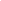

# Respond to an attack

Someone is hammering one of your hosts. What to look at, what to
ban, what to tune — in the order you reach for them.

Most of what you need is already wired: CrowdSec is running in
front of your edge, the WAF logs every Coraza/CRS match, and argos
aggregates both into the Security overview. The playbook below is
"what do I click while it is happening" and "what do I change to
stop it from happening again".

## 1. Confirm it is real traffic

First read: **Dashboard → Security**. The cards show:

- **Blocked last hour / 24 h** — CrowdSec bouncer + WAF blocks.
- **Attack sources** — world map of offending IPs with GeoIP
  country flags.
- **Top offending IPs** — sorted by hit count in the window.
- **Top rules** — which CRS rule fired most.

If these cards are hot, you have a real incident. If they are cold
but the backend is struggling, it is a load problem, not an attack —
skip to [Tuning](../operations/tuning.md).

{ loading=lazy alt="Dashboard Security tab showing blocked requests counters, world map of attacking IPs, and top offenders table" }

## 2. Identify the pattern

Open **Threats** for the current CrowdSec decisions list. Each
decision carries:

- IP (or CIDR).
- Scenario — the CrowdSec label that produced the ban
  (`crowdsecurity/http-probing`, `crowdsecurity/http-bf-wordpress_bf`,
  ...). Useful to understand *what* is being tried.
- TTL — how long CrowdSec will keep the decision active.
- Origin — `crowdsec` (local detection) vs `community-blocklist`
  (the community feed).

Alongside it open **Logs** with filter
`source = waf_audit` and the timeframe set to the last hour. The WAF
audit entries include the matched rule, anomaly score, path, and
remote IP. Sort by `waf_anomaly_score DESC` to surface the loudest
requests.

## 3. Block one IP (manually)

Rarely needed — CrowdSec is usually already ahead of you — but
when you want a specific IP banned immediately:

**Threats → Add decision**:

- IP: the offending address.
- Duration: `4h`, `24h`, `7d`, or a custom string.
- Reason: free text, ends up in the audit log.

The decision takes effect on the next request (Caddy polls CrowdSec
LAPI every `crowdsec.poll_interval_seconds`, default 15 s). The IP
sees 403 from the bouncer before any request reaches the WAF or your
upstream.

To unban: same tab, find the row, click **Delete decision**.

## 4. Block a path or a header pattern

If the attack is better characterised by path than by IP (scanners
hitting `/wp-login.php` on a non-WordPress host, for example),
create a rule on the host:

**Hosts → *your host* → Rules → New rule**:

- Priority: any low number. Rules evaluate low-first.
- Matchers: path `=` `/wp-login.php` (or `starts_with` etc.).
- Action: `block` (returns 403).

The rule lands in Caddy on the next reconcile. `curl` the path from
outside to confirm the 403.

## 5. Turn the WAF to block if it was in detect

If you ran the WAF in `detect` mode ([Add a host](add-host.md) step
5), this is when you flip it:

**Hosts → *your host* → Security → WAF mode = block**. Save.

In-band CRS matches now return the configured block status (default
403). Watch **AppSec → metrics** for the next few minutes — a
clean WAF rollout shows Hits going up for the attack rule(s) and
*not* for your own traffic. False positives on legit endpoints mean
you need exclusions, not a mode revert:

**Hosts → *your host* → Security → Exclusions → New**:

- CRS rule ID (from the WAF audit log).
- Path pattern (scope to the endpoint that trips the false
  positive).
- Reason (free text for the audit log).

Narrow the scope as much as possible — a path-level exclusion is
fine, a rule-wide disable is blunt.

## 6. Turn on rate limiting if you did not already

**Hosts → *your host* → Security → Rate limit enabled**.

- Key: `ip` for per-client limits (most common), `global` if you
  are under a distributed burst and can accept the shared-pool
  trade-off.
- Requests / Window: start permissive, tighten if the attack
  continues. `100 / 60` is a reasonable first try for a path the
  attacker is enumerating.

Requests over the limit return 429 with a `Retry-After` header and
show up in `caddy_access` logs with status 429 so you can measure
the effect.

## 7. Wire a notification rule (so the next incident auto-alerts)

If you had to go looking at the dashboard to find out this was
happening, wire a rule so the next one pages you instead.

**Notifications → Rules → New rule**:

- Event type: `waf_attack_burst` or `rate_limit_triggered` — see
  [Notifications](../features/notifications.md) for the full event
  catalog.
- Channel: whatever you have configured (Slack webhook, email,
  Telegram, browser push).
- Filter by host if you want noise scoped.
- Throttle window: `300` seconds. Dedups bursts so you do not
  drown.

Test: **Channels → *your channel* → Test channel** sends a canary
message.

## 8. Afterwards

Once the attack has subsided:

- **Logs** filter `source = waf_audit AND host_domain = *your host*`,
  export to CSV if you want an incident artifact.
- **Threats** — review the decisions added during the incident.
  Long-duration bans (7d+) age out on their own. Short ones do too;
  usually no cleanup needed.
- **Exclusions** — if you added any in a hurry, revisit them next
  week to confirm scope is still as narrow as possible.
- **AppSec paranoia** — if the attack pattern tripped too few CRS
  rules, consider bumping `waf_paranoia` from `1` to `2` on the host.
  Higher paranoia is noisier but catches more.

## Related

- [WAF](../features/waf.md) — Coraza/CRS internals + modes.
- [CrowdSec](../features/crowdsec.md) — bouncer + community feed.
- [Notifications](../features/notifications.md) — event catalog +
  channel setup.
- [Monitoring](../operations/monitoring.md) — what to watch
  continuously.
