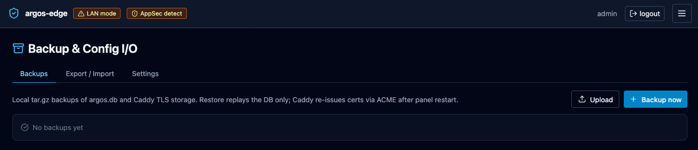

# Restore from backup

Bring a panel back to the last known-good state after a bad change,
a corrupt DB, or a fresh install on new hardware.

## What is in an argos backup

Each backup is a single tar.gz under `/data/backups/` containing:

- **`argos.db`** — a `VACUUM INTO` snapshot of the SQLite DB at the
  moment the backup ran. Fully consistent, no WAL residue.
- **`metadata.json`** — argos version, git commit, schema version,
  timestamp, kind (`manual` / `scheduled` / `orphan`), count of
  caddy files included.
- **`caddy/`** (optional) — a copy of the Caddy data directory
  (`/data` in the caddy container, mounted read-only into argos)
  if the argos container had access to it at backup time. Contains
  TLS certs + ACME state.

Backups are local only; there is no argos-side rclone / off-site
push. If you need off-site, mirror `/data/backups/` out of band
(rclone as a sidecar container, borg, rsync, whatever you already
run).

## 1. Pick the source

**Backups** tab shows every row recorded in the panel DB. Columns:
filename, size, sha256, kind, created, note.

{ loading=lazy alt="Backups tab listing scheduled and manual backups with their size, sha256 prefix, kind, and timestamp" }

If the DB itself is intact you can restore in-place from the row.
If the DB is corrupt or you are on a fresh install, upload the
tar.gz from disk — you need to have a copy already.

## 2a. In-place restore (DB still works)

Prerequisite: the backup is in `/data/backups/` and listed in the
Backups tab.

**Backups → *row* → Restore**. Confirm the dialog. Argos:

1. Writes a marker file `/data/.restore_pending` containing the
   archive path.
2. Returns 202 and drops your session.
3. On next container start (you restart manually), argos reads the
   marker, extracts the tar.gz on top of `/data`, replaces
   `argos.db`, then clears the marker and boots normally.

You will have to `docker compose restart argos` yourself — the
endpoint schedules the work but does not self-kill.

```bash
docker compose restart argos
```

After restart, log in again. The panel is back at the state of the
backup.

## 2b. CLI restore (fresh install or unreachable panel)

If the panel's own DB is not usable (you cannot log in, cannot reach
the Backups tab), use the `argos restore` subcommand. It runs
directly against the container's data volume and does not need a
session.

Bring the tar.gz onto the argos host, then:

```bash
# Copy the tar.gz into the argos data volume.
docker compose cp ./argos-backup-20260418-021500.tar.gz argos:/data/backups/

# Invoke the restore CLI. Both --file and --yes are required;
# --yes acknowledges that the current DB will be replaced.
docker compose exec argos \
  argos restore --file /data/backups/argos-backup-20260418-021500.tar.gz --yes

docker compose restart argos
```

Same finish: the restart reads the `/data/.restore_pending` marker
the CLI wrote and extracts.

There is also an authed HTTP endpoint (`POST
/api/backups/upload-and-restore`) for operators who have a working
panel but want to restore an archive that was never listed in the
Backups tab (e.g. copied in from another host). The CLI is the
right tool when the panel is unreachable.

## 3. Verify

After the restart:

1. Log in. Credentials are from the backup's point in time — if you
   rotated the admin password between backup and restore, use the
   pre-rotation password.
2. **Backups** tab: the restore itself shows up as an audit event;
   no new backup row is created (the restore is not a snapshot).
3. **Hosts** tab: every host from the backup is there and Caddy is
   already configured for them (the reconciler runs on boot).
4. **Certs** tab: if `caddy/` was included in the tar.gz, the certs
   are already valid. If not, the next request to each host
   triggers a fresh ACME exchange.

## 4. What is NOT in the backup

- **In-memory state**: pending OIDC logins, TOTP challenge store,
  ForwardAuth cache, notification rate-limit buckets. All of them
  live in process memory and rebuild on the fly — safe to lose.
- **CrowdSec's own DB** (`crowdsec_data` volume). If you lost that
  too, CrowdSec will re-enroll and re-download the community feed
  on its own; you may need to regenerate the bouncer API key
  (`docker compose exec crowdsec cscli bouncers add caddy`) and
  update the Caddy config.
- **Caddy access + error logs**. Backups cover current state, not
  history. Log-entries rows up to the backup point are included in
  `argos.db`; anything written after is gone.

!!! note "Manual cert files are NOT in the tarball — but they come back automatically"
    The `caddy_manual_certs` volume (plaintext `.crt` + `.key` for
    manual-mode hosts) is out of scope for the backup tarball.
    The encrypted key lives in `argos.db`'s `host_manual_certs`
    table; on the next boot the panel's reconciler decrypts it
    and writes the files to the caddy-shared volume. Cross-host
    restore works without separately capturing this volume **as
    long as `ARGOS_MASTER_KEY` is unchanged**. See
    [Manual certificates → Disaster recovery](../features/manual-certs.md#disaster-recovery).

!!! warning "`ARGOS_MASTER_KEY` is required for DR"
    Without the original `ARGOS_MASTER_KEY` every encrypted
    secret is unrecoverable: manual cert keys, OIDC client
    secrets, SMTP passwords, Telegram tokens, VAPID private
    keys. Keep `.env` out of band alongside the tarball. A
    backup is not enough on its own.

## 5. Rolling back a failed restore

If the restore marker file got written but the extract fails, argos
refuses to boot and logs the reason (`docker compose logs argos`).
Clear the marker by hand:

```bash
docker compose exec argos rm -f /data/.restore_pending
docker compose restart argos
```

The panel boots with whatever DB was there before the restore
attempt (the extract is all-or-nothing; failure leaves you on the
pre-restore state).

## Related

- [Backups](../features/backups.md) — feature reference, scheduler
  config, manual backup, disk layout.
- [Upgrading](../operations/upgrading.md) — take a backup before
  any upgrade.
- [CLI](../reference/cli.md) — `argos restore --file` for the same
  operation without a running panel.
